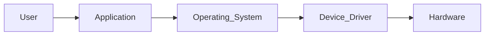

# Lesson 05: Computer Software Fundamentals

> **Book:** Book 01 – Foundations
>
> **Module:** Module 01 – Computer Fundamentals
>
> **Lesson:** 05
>
> **Difficulty:** Beginner
>
> **Estimated Reading Time:** 45–60 Minutes

---

# Learning Objectives

After completing this lesson, you will be able to:

- Explain what software is and why it is essential.
- Differentiate software from hardware.
- Understand how software controls computer hardware.
- Identify the major categories of software.
- Recognize common software used in daily life.
- Build the foundation required for learning operating systems and programming.

---

# Prerequisites

Before studying this lesson, you should understand:

- What a computer is
- Basic computer hardware
- Types of computers
- CPU, memory, storage, and input/output devices

These topics were covered in the previous lessons.

---

# Introduction

Imagine purchasing the most powerful computer available today:

- 32-core processor
- 64 GB RAM
- 4 TB SSD
- High-end graphics card
- 8K display

Now imagine turning it on and seeing... nothing useful.

No desktop.
No applications.
No operating system.
No browser.
No files.

The hardware is powerful, but it cannot perform meaningful work on its own.

This simple thought experiment reveals one of the most important ideas in computer science:

> **Hardware provides the capability; software provides the intelligence.**

Software transforms electronic components into useful tools for communication, creativity, learning, engineering, healthcare, finance, entertainment, and scientific research.

Whether you are writing code, editing a photo, sending an email, or launching a spacecraft, software is responsible for instructing the hardware how to perform each task.

In modern computing, billions of devices—from smartphones and smart TVs to cloud servers and satellites—depend on software every second.

Understanding software is therefore essential for every aspiring developer, engineer, or IT professional.

---

# What Is Software?

Software is a collection of programs, instructions, data, and related documentation that directs computer hardware to perform specific tasks.

Unlike hardware, software has no physical form. You cannot touch it or hold it in your hand. Instead, it exists as digital information stored on storage devices and loaded into memory when the computer executes it.

Whenever you click an application icon, open a website, or play a video, the computer follows thousands—or even millions—of software instructions behind the scenes.

## Formal Definition

> **Software is a set of instructions and associated data that tells a computer system how to perform specific operations.**

Software acts as the intermediary between the user and the computer's electronic components.

Without software:

- The CPU has no meaningful instructions to execute.
- Memory stores no useful programs.
- Input devices collect information that cannot be processed.
- Output devices have nothing meaningful to display.

In other words, software gives purpose to hardware.

---

# Why Is Software Important?

Nearly every interaction with a modern computer depends on software.

Consider a few everyday activities:

| Activity | Software Involved |
|-----------|-------------------|
| Browsing the Internet | Web browser |
| Sending email | Email client |
| Watching videos | Media player |
| Online banking | Banking application |
| Video calls | Communication software |
| Writing documents | Word processor |
| Programming | Code editor and compiler |
| Gaming | Game engine and game software |

Even when you unlock your smartphone, dozens of software components work together to recognize your fingerprint, verify your identity, display the home screen, and launch applications.

Software is not limited to personal computers.

It powers:

- Cars
- Airplanes
- Hospitals
- Factories
- ATMs
- Smart homes
- Satellites
- Robots
- Medical equipment
- Artificial intelligence systems

Today, software is one of the primary drivers of innovation across nearly every industry.

---

# Characteristics of Software

Software differs from hardware in several important ways.

## 1. Software Is Intangible

Unlike a keyboard or monitor, software cannot be physically touched.

Instead, it exists as digital instructions stored electronically.

---

## 2. Software Is Developed

Hardware is manufactured.

Software is engineered through analysis, design, programming, testing, and maintenance.

This makes software development an engineering discipline rather than a manufacturing process.

---

## 3. Software Can Be Copied

Creating another copy of software does not consume the original.

A single application can be installed on millions of devices.

---

## 4. Software Evolves

Software is continuously updated.

Updates may:

- Fix bugs
- Improve security
- Add new features
- Increase performance
- Improve compatibility

This is why your computer and smartphone regularly receive updates.

---

## 5. Software Does Not Physically Wear Out

A hard disk may fail.

A keyboard may break.

Software does not physically deteriorate.

However, software can become obsolete because of changing technology, new operating systems, evolving hardware, or security requirements.

---

# Did You Know?

The software running on a modern passenger aircraft may contain **millions of lines of source code**, and large cloud platforms often consist of many independent services developed by different teams. Managing software at this scale requires rigorous engineering practices such as testing, version control, automation, and continuous monitoring.

---

# Hardware vs. Software

One of the most common beginner misconceptions is treating hardware and software as the same thing.

They are closely related, but they serve different purposes.

| Hardware | Software |
|-----------|----------|
| Physical components | Programs and instructions |
| Can be touched | Cannot be touched |
| Manufactured | Developed |
| May wear out physically | Does not physically wear out |
| CPU, RAM, SSD, Keyboard | Windows, Linux, Chrome, VS Code |

Neither hardware nor software is useful by itself.

Hardware provides computing resources.

Software tells those resources what to do.

Together, they form a complete computer system.

---

# Real-World Analogy

Imagine a kitchen.

- The stove, oven, utensils, and refrigerator are the **hardware**.
- A recipe is the **software**.
- The chef follows the recipe to prepare the meal.

Without the equipment, the recipe cannot be executed.

Without the recipe, the equipment has no meaningful purpose.

A computer works in a similar way.

---

# Classification of Software

Software is not a single type of program. Different software serves different purposes depending on the needs of the user and the computer system.

Broadly, software is classified into five major categories:

```text
Software
│
├── System Software
├── Application Software
├── Utility Software
├── Programming Software
└── Firmware
```

Each category performs a unique role within a computer system.

Let's understand each one in detail.

---

# System Software

## Introduction

System software is the foundation of every computer system.

It acts as an intermediary between the computer's hardware and the application software used by the user.

Without system software, applications such as Microsoft Word, Google Chrome, or Visual Studio Code cannot communicate directly with the computer's hardware.

System software ensures that all hardware resources are managed efficiently and shared among multiple applications.

---

## Definition

> **System software is software designed to manage computer hardware and provide a platform for running application software.**

It controls the basic operations of a computer and enables the entire system to function correctly.

---

## Responsibilities of System Software

System software performs many essential tasks, including:

- Managing CPU resources
- Managing memory
- Managing files and folders
- Controlling hardware devices
- Managing storage devices
- Providing security
- Running applications
- Handling networking services
- Detecting hardware errors
- Managing user accounts

Without these responsibilities, modern computing would not be possible.

---

## Components of System Software

System software generally consists of:

- Operating System
- Device Drivers
- Utility Programs
- Language Translators
- Firmware

These components work together to create a stable computing environment.

---

# Operating System (OS)

## What is an Operating System?

An **Operating System (OS)** is the most important type of system software.

It manages the computer's hardware and provides services to application programs.

Simply put,

> **The operating system is the manager of the entire computer.**

Every command issued by the user eventually passes through the operating system.

Examples include:

- Microsoft Windows
- Linux
- macOS
- Android
- iOS

---

## Responsibilities of an Operating System

An operating system is responsible for:

### Process Management

Controls running programs and allocates CPU time.

Example:

Running:

- Browser
- Music Player
- Code Editor

simultaneously.

---

### Memory Management

Allocates RAM to different applications.

Ensures one program does not interfere with another.

---

### File Management

Creates, stores, deletes and organizes files.

Examples:

- Documents
- Images
- Videos
- Source code

---

### Device Management

Controls hardware devices such as:

- Keyboard
- Mouse
- Printer
- Scanner
- Monitor
- USB devices

---

### Security Management

Provides:

- User authentication
- Password protection
- Access permissions
- Encryption support

---

### User Interface

Allows users to interact with the computer through:

- Graphical User Interface (GUI)
- Command Line Interface (CLI)

---

# Types of Operating Systems

Operating systems can be categorized based on how they manage users, tasks, and hardware.

## Single User Operating System

Designed for one user at a time.

Example:

- Windows 11 (personal use)
- macOS

---

## Multi-user Operating System

Allows multiple users to access the same system.

Common in:

- Universities
- Enterprise servers
- Cloud infrastructure

Example:

- Linux servers
- UNIX

---

## Multitasking Operating System

Allows multiple applications to run simultaneously.

Example:

Listening to music while browsing the web and editing a document.

Modern operating systems support multitasking.

---

## Real-Time Operating System (RTOS)

Designed for systems that require immediate responses.

Common applications:

- Medical equipment
- Industrial automation
- Aircraft control systems
- Robotics

---

## Mobile Operating System

Designed specifically for smartphones and tablets.

Examples:

- Android
- iOS

These operating systems are optimized for touch input, battery efficiency, and mobile hardware.

---

# Device Drivers

A **device driver** is specialized software that enables the operating system to communicate with hardware devices.

Without drivers, the operating system may recognize that hardware exists but not know how to operate it.

Examples:

- Printer Driver
- Graphics Driver
- Audio Driver
- Network Driver
- USB Driver

Whenever you install a new printer or graphics card, the correct driver is usually installed to ensure proper communication.

---

## Driver Communication Flow



The driver acts as a translator between the operating system and the hardware.

---

# Firmware

Firmware is software permanently stored inside hardware devices.

Unlike regular applications, firmware starts working as soon as the device is powered on.

Examples include:

- BIOS
- UEFI
- Wi-Fi Router Firmware
- SSD Firmware
- Smart TV Firmware

Firmware performs low-level hardware initialization before the operating system loads.

---

# BIOS and UEFI

When a computer starts, firmware performs initial hardware checks.

Traditionally this firmware was known as the **BIOS (Basic Input/Output System)**.

Modern computers generally use **UEFI (Unified Extensible Firmware Interface)**, which provides features such as:

- Faster startup
- Larger disk support
- Improved security
- Better graphical configuration interfaces

Although UEFI has largely replaced BIOS in new systems, both serve the same fundamental purpose: preparing the hardware so that the operating system can start.

---

# Did You Know?

Every time you power on your computer, firmware begins working **before** Windows, Linux, or macOS starts loading. It checks essential hardware components, initializes them, and then hands control over to the operating system.


---

# Application Software

## Introduction

While system software manages the computer itself, **application software** is designed to help users perform specific tasks.

Whenever you write a document, browse the internet, edit a photograph, play a game, attend an online meeting, or watch a movie, you are interacting with application software.

Application software focuses on **solving user problems**, whereas system software focuses on **managing computer resources**.

---

## Definition

> **Application software is software designed to help users perform one or more specific tasks.**

Unlike system software, application software is installed according to the user's needs and preferences.

Examples include:

- Microsoft Word
- Microsoft Excel
- Microsoft PowerPoint
- Google Chrome
- Mozilla Firefox
- Adobe Photoshop
- VLC Media Player
- Zoom
- WhatsApp Desktop
- Visual Studio Code

---

# Characteristics of Application Software

Application software generally has the following characteristics:

- Designed for specific user tasks.
- Depends on the operating system.
- Provides a user-friendly interface.
- Can be installed, updated, or removed independently.
- Available for personal, educational, business, and industrial use.

---

# Types of Application Software

Application software can be classified into several categories.

## Productivity Software

Helps users create and manage information.

Examples:

- Microsoft Word
- Microsoft Excel
- Google Docs
- LibreOffice Writer

Common uses:

- Reports
- Assignments
- Letters
- Spreadsheets
- Presentations

---

## Web Browsers

Web browsers allow users to access websites and web applications.

Examples:

- Google Chrome
- Mozilla Firefox
- Microsoft Edge
- Safari

Modern browsers also support:

- Extensions
- Developer Tools
- Password Managers
- Synchronization across devices

---

## Multimedia Software

Used to create, edit, or play audio and video.

Examples:

- VLC Media Player
- Adobe Premiere Pro
- Audacity
- OBS Studio

Applications include:

- Video editing
- Audio recording
- Music playback
- Live streaming

---

## Graphics and Design Software

Designed for creating and editing images, illustrations, animations, and digital artwork.

Examples:

- Adobe Photoshop
- Adobe Illustrator
- GIMP
- Figma
- Blender

Used by:

- Graphic Designers
- UI/UX Designers
- Architects
- Engineers
- Animators

---

## Communication Software

Facilitates communication and collaboration.

Examples:

- Microsoft Teams
- Slack
- Zoom
- Discord
- WhatsApp

Common features:

- Video conferencing
- Screen sharing
- File sharing
- Chat
- Voice calls

---

## Educational Software

Designed to support teaching and learning.

Examples include:

- Learning Management Systems (LMS)
- Language learning applications
- Interactive educational platforms
- Virtual laboratories

---

## Entertainment Software

Entertainment software includes games and multimedia applications.

Examples:

- Minecraft
- Steam
- Spotify
- Netflix applications

---

# Utility Software

## What Is Utility Software?

Utility software helps maintain, optimize, protect, and improve the performance of a computer system.

Unlike application software, utility programs usually operate in the background or are used periodically for system maintenance.

---

## Common Utility Software

### Antivirus Software

Protects the computer from:

- Viruses
- Worms
- Trojans
- Spyware
- Ransomware

Examples:

- Microsoft Defender
- Bitdefender
- Norton

---

### Backup Software

Creates copies of important files to prevent data loss.

Common backup locations include:

- External Hard Drives
- NAS Devices
- Cloud Storage

---

### Disk Cleanup Tools

Remove:

- Temporary files
- Cache files
- System logs
- Unnecessary data

This helps recover storage space.

---

### Compression Software

Compresses files to reduce storage requirements.

Examples:

- 7-Zip
- WinRAR
- WinZip

Common formats:

- ZIP
- RAR
- 7Z

---

### Password Managers

Securely store passwords using encryption.

Examples:

- Bitwarden
- KeePass
- 1Password

---

# Programming Software

Programming software provides developers with tools required to create other software.

Without programming software, software development would not be possible.

---

## Common Programming Tools

Programming software includes:

- Code Editors
- Integrated Development Environments (IDEs)
- Compilers
- Interpreters
- Assemblers
- Debuggers
- Build Tools
- Version Control Systems

Examples:

- Visual Studio Code
- IntelliJ IDEA
- Eclipse
- GCC
- Git
- CMake

---

# Language Translators

Computers understand only **machine language (binary instructions).**

Humans, however, write programs using programming languages such as C, Java, Python, JavaScript, or C++.

A **language translator** converts human-readable source code into a form that the computer can execute.

There are three primary types of language translators.

---

## Compiler

A compiler translates the **entire source code** into machine code before execution.

### Advantages

- Faster program execution
- Optimized machine code
- Better performance

### Examples

- GCC
- Clang
- Microsoft Visual C++ Compiler

---

## Interpreter

An interpreter translates and executes source code **one statement at a time**.

### Advantages

- Easier debugging
- Immediate execution
- Suitable for scripting languages

### Examples

- Python Interpreter
- JavaScript Engine
- Ruby Interpreter

---

## Assembler

An assembler converts **assembly language** into machine language.

Assembly language uses mnemonic instructions that are easier for humans to understand than binary.

Example:

```assembly
MOV AX, BX
ADD AX, 10
```

The assembler converts these instructions into binary instructions that the CPU can execute.

---

# Compiler vs Interpreter

| Compiler | Interpreter |
|-----------|-------------|
| Translates the entire program | Translates one statement at a time |
| Produces an executable file | Executes directly |
| Faster execution | Slower execution |
| Errors shown after compilation | Errors shown during execution |
| Better performance | Easier debugging |

---

# Programming Languages

Programming languages enable humans to communicate with computers.

They provide structured syntax and rules for writing software.

Programming languages are generally divided into three levels.

---

## Machine Language

Machine language consists entirely of binary digits.

Example:

```text
10110010 11001100
```

Advantages:

- Fastest execution
- Directly understood by the CPU

Disadvantages:

- Extremely difficult to read and write
- Error-prone
- Not portable

---

## Assembly Language

Assembly language uses mnemonic instructions.

Example:

```assembly
MOV AX, BX
```

Advantages:

- Easier than machine language
- Greater control over hardware

Disadvantages:

- Hardware-dependent
- Difficult for large applications

---

## High-Level Languages

High-level languages resemble human language and are easier to learn.

Examples include:

- C
- C++
- Java
- Python
- JavaScript
- C#
- Go
- Rust
- Swift
- Kotlin

Advantages:

- Easy to learn
- Portable across platforms
- Faster development
- Better maintainability

---

# Software in Everyday Life

Software is deeply integrated into modern life.

Examples include:

| Industry | Software Examples |
|----------|-------------------|
| Banking | Core Banking Systems, Mobile Banking Apps |
| Healthcare | Electronic Health Records, Diagnostic Systems |
| Education | LMS Platforms, Virtual Classrooms |
| Retail | Billing Systems, Inventory Management |
| Transportation | Airline Reservation Systems, Navigation Apps |
| Manufacturing | ERP Systems, Robotics Control Software |
| Entertainment | Streaming Platforms, Gaming Engines |

Regardless of the industry, software enables automation, improves efficiency, and supports decision-making.

---

# Did You Know?

A modern web browser is one of the most complex consumer software applications. It combines rendering engines, JavaScript execution, networking, graphics acceleration, multimedia support, security features, and developer tools into a single application.

---

# Software Licensing

## Introduction

Not all software can be used in the same way. Some software is completely free to use and modify, while other software requires purchasing a license or subscribing to a service.

A **software license** is a legal agreement that defines how software can be installed, used, copied, modified, and distributed.

Understanding software licensing is important for individuals, businesses, developers, and organizations because using software outside the terms of its license may violate copyright laws or contractual agreements.

---

## Why Software Licensing Matters

Software licensing helps:

- Protect the intellectual property of software creators.
- Define user rights and responsibilities.
- Prevent unauthorized copying or distribution.
- Generate revenue for software companies.
- Encourage collaboration in open-source communities.

---

# Types of Software Licenses

## Proprietary Software

Proprietary software is owned by an individual or company. Users receive permission to use the software but generally cannot view or modify its source code.

### Characteristics

- Closed source
- Commercial license
- Source code is not publicly available
- Modification is restricted

### Examples

- Microsoft Windows
- Microsoft Office
- Adobe Photoshop
- AutoCAD

### Advantages

- Professional support
- Regular updates
- Commercial-grade features

### Limitations

- Paid licenses
- Limited customization
- Vendor dependency

---

## Open-Source Software

Open-source software makes its source code publicly available under an open-source license.

Users can study, modify, and distribute the software according to the license terms.

### Characteristics

- Transparent development
- Community contributions
- Flexible customization
- Often free to use

### Examples

- Linux
- Mozilla Firefox
- LibreOffice
- Blender
- GIMP
- VLC Media Player

### Advantages

- Free or low cost
- Community-driven innovation
- High transparency
- Strong educational value

### Considerations

- Support quality may vary by project.
- Some projects rely primarily on community contributions rather than commercial support.

---

## Freeware

Freeware is software that can be used without paying a purchase price.

However, being free to use does **not** automatically make software open source.

### Examples

- Adobe Acrobat Reader
- Google Chrome
- Skype (free tier)

---

## Shareware

Shareware allows users to evaluate software before purchasing a license.

Common forms include:

- Time-limited trials
- Feature-limited editions
- Trial versions with reminders to purchase

Examples include evaluation versions of commercial productivity, security, or multimedia software.

---

## Public Domain Software

Public domain software is software whose copyright has been waived or has expired, allowing it to be used without copyright restrictions.

This is relatively uncommon compared with open-source software.

---

# Comparing Software License Types

| License Type | Source Code Available | Cost | Modification Allowed |
|--------------|----------------------|------|----------------------|
| Proprietary | No | Usually Paid | No |
| Open Source | Yes | Often Free | Yes (subject to license terms) |
| Freeware | Usually No | Free | Usually No |
| Shareware | Usually No | Trial then Paid | Usually No |
| Public Domain | Yes | Free | Yes |

---

# Installing Software

Software installation is the process of copying program files to a computer and configuring them for use.

Typical installation steps include:

1. Download the installer.
2. Accept the license agreement.
3. Choose an installation location.
4. Install required components.
5. Complete the setup.
6. Launch the application.

Some software is distributed through operating system app stores or package managers instead of standalone installers.

---

# Software Updates

Software is updated to improve functionality, reliability, compatibility, and security.

Updates may include:

- Bug fixes
- Security patches
- Performance improvements
- New features
- Compatibility enhancements

Keeping software up to date helps reduce security risks and ensures compatibility with modern systems.

---

# Software Maintenance

Software development does not end after release.

Applications require ongoing maintenance throughout their lifecycle.

Common maintenance activities include:

## Corrective Maintenance

Fixes defects and software bugs discovered after release.

---

## Adaptive Maintenance

Updates software to work with changes in hardware, operating systems, regulations, or external services.

---

## Perfective Maintenance

Improves performance, usability, or functionality based on user feedback.

---

## Preventive Maintenance

Refactors or improves the codebase to reduce future maintenance costs and improve long-term reliability.

---

# Introduction to the Software Development Life Cycle (SDLC)

Professional software is typically developed using a structured process known as the **Software Development Life Cycle (SDLC).**

The SDLC helps teams plan, build, test, deploy, and maintain software in an organized manner.

A simplified SDLC consists of the following phases:


## Planning

The project goals, scope, timeline, budget, and stakeholders are identified.

---

## Requirements Analysis

Developers and stakeholders gather and document what the software should accomplish.

---

## Design

Architects and designers define the software's structure, user interface, and technical architecture.

---

## Development

Developers write the source code using programming languages and development tools.

---

## Testing

Quality assurance teams verify that the software behaves as intended and identify defects before release.

---

## Deployment

The software is released to users or customers.

---

## Maintenance

After deployment, the software continues to evolve through updates, bug fixes, and enhancements.

---

# Best Practices When Using Software

Following good software practices improves reliability, performance, and security.

Recommended practices include:

- Install software only from trusted sources.
- Keep the operating system and applications updated.
- Use reputable antivirus or endpoint protection where appropriate.
- Regularly back up important data.
- Use strong passwords and enable multi-factor authentication when available.
- Remove unused software to reduce maintenance and security overhead.
- Read license terms before distributing or modifying software.
- Keep critical software properly licensed.

---

# Common Mistakes Beginners Make

New users often make mistakes that can affect system performance or security.

Examples include:

- Downloading software from untrusted websites.
- Ignoring software updates.
- Using outdated or unsupported applications.
- Installing unnecessary software.
- Disabling security features without understanding the consequences.
- Confusing freeware with open-source software.
- Assuming every free application is safe to install.

Being aware of these mistakes helps users build safer computing habits.

---

# Real-World Case Study

## Installing a Web Browser

Suppose you purchase a new computer.

To browse the internet, you install a web browser.

During this process:

1. You download the installer from the official website.
2. You review and accept the license agreement.
3. The installer copies the required program files.
4. Shortcuts are created.
5. The application registers itself with the operating system.
6. Future updates improve security, fix defects, and add features.

This simple example demonstrates how software installation, licensing, maintenance, and updates work together in everyday computing.

---

# Chapter Summary

In this lesson, you learned:

- What software is and why it is essential.
- The relationship between hardware and software.
- The major categories of software.
- The purpose of operating systems, drivers, firmware, utilities, and application software.
- The role of programming software and language translators.
- Common software license models.
- The importance of software installation, updates, and maintenance.
- The basic phases of the Software Development Life Cycle.

These concepts provide the foundation for understanding operating systems, programming, and software engineering in later DevAtlas books.

---

# Glossary

| Term | Definition |
|------|------------|
| Software | A collection of programs and instructions that tell a computer what to do. |
| Hardware | The physical components of a computer system. |
| Operating System | System software that manages hardware and provides services for applications. |
| Application Software | Software designed to help users perform specific tasks. |
| Utility Software | Software that maintains, optimizes, and protects a computer system. |
| Firmware | Low-level software permanently stored in hardware devices. |
| Device Driver | Software that enables communication between the operating system and hardware. |
| Compiler | A program that translates an entire source code file into machine code before execution. |
| Interpreter | A program that translates and executes source code one statement at a time. |
| Assembler | A program that converts assembly language into machine language. |
| Open-Source Software | Software whose source code is available for study, modification, and distribution under its license terms. |
| Proprietary Software | Software owned by an individual or organization with restricted access to its source code. |
| Freeware | Software that can be used without purchase but is not necessarily open source. |
| Shareware | Software distributed for evaluation before requiring payment. |
| SDLC | Software Development Life Cycle, a structured process for building and maintaining software. |

---

# Quick Revision Notes

Remember these key concepts before moving to the next lesson.

- Software provides instructions for hardware.
- Hardware and software depend on each other.
- Software is classified into:
  - System Software
  - Application Software
  - Utility Software
  - Programming Software
  - Firmware
- The operating system manages hardware resources.
- Device drivers allow the operating system to communicate with hardware.
- Firmware starts before the operating system.
- Compilers, interpreters, and assemblers translate programs for execution.
- Software licenses determine how software can be used and distributed.
- Software requires installation, updates, and maintenance throughout its lifecycle.
- The SDLC provides a structured approach to software development.

---

# Hands-on Exercises

## Exercise 1 – Identify the Software

Classify each item into the correct category.

| Software | Category |
|----------|----------|
| Windows 11 | __________ |
| Google Chrome | __________ |
| Microsoft Word | __________ |
| Bitwarden | __________ |
| BIOS / UEFI | __________ |
| GCC Compiler | __________ |
| VLC Media Player | __________ |

---

## Exercise 2 – Hardware vs. Software

Create a two-column table and list ten examples of hardware and ten examples of software that you use regularly.

---

## Exercise 3 – Explore Your Computer

Open your computer and identify:

- The operating system version.
- Three installed application programs.
- One utility application.
- One device driver (from Device Manager or System Information).
- Any pending software updates.

Record your observations.

---

## Exercise 4 – Research Activity

Choose one open-source software project (for example, Linux, Blender, or LibreOffice) and answer:

- What problem does it solve?
- Which license does it use?
- Who develops it?
- Why is it popular?

---

## Exercise 5 – Compare Software Licenses

Create a comparison table for:

- Proprietary Software
- Open-Source Software
- Freeware
- Shareware

Include:

- Cost
- Source code availability
- Modification rights
- Typical examples

---

# Practice Questions

### Short Answer Questions

1. What is software?
2. Why is software necessary for a computer?
3. Differentiate between hardware and software.
4. What is system software?
5. What is application software?
6. Define firmware.
7. What is a device driver?
8. Explain the role of utility software.
9. What is the difference between freeware and open-source software?
10. What is the purpose of software maintenance?

---

### Long Answer Questions

1. Explain the major categories of software with examples.
2. Describe the functions of an operating system.
3. Compare proprietary and open-source software.
4. Explain the Software Development Life Cycle.
5. Discuss the importance of software updates and maintenance.

---

# Interview Questions

### Beginner Level

1. What is software?
2. What is the difference between hardware and software?
3. What is an operating system?
4. Name five examples of application software.
5. What is firmware?
6. What is a device driver?
7. What is utility software?
8. What is a compiler?
9. What is an interpreter?
10. What is software licensing?

---

### Intermediate Level

1. Explain how an operating system manages hardware resources.
2. Compare compilers and interpreters with suitable examples.
3. Describe the purpose of software maintenance.
4. Why are software updates important?
5. Explain the phases of the Software Development Life Cycle.

---

# Mini Quiz

Choose the correct answer.

### 1. Which type of software manages computer hardware?

A. Application Software

B. Utility Software

C. System Software

D. Multimedia Software

**Answer:** C

---

### 2. Which software starts before the operating system?

A. Browser

B. Firmware

C. Spreadsheet

D. Media Player

**Answer:** B

---

### 3. Which translator converts an entire program before execution?

A. Interpreter

B. Compiler

C. Loader

D. Linker

**Answer:** B

---

### 4. Which software helps protect a computer from malware?

A. Spreadsheet

B. Antivirus

C. Presentation Software

D. Web Browser

**Answer:** B

---

### 5. Which license usually allows users to study and modify the source code?

A. Proprietary

B. Shareware

C. Open Source

D. Trial

**Answer:** C

---

# Key Takeaways

After completing this lesson, you should remember that:

- Software is the intelligence that enables hardware to perform useful tasks.
- Every computer relies on system software to operate correctly.
- Application software is designed to solve user-specific problems.
- Utility software improves system performance, maintenance, and security.
- Programming software helps developers create applications.
- Firmware initializes hardware before the operating system starts.
- Language translators convert human-readable programs into machine-executable instructions.
- Software licenses define how software may be used and distributed.
- Software engineering continues after release through updates and maintenance.

---

# Further Reading

To deepen your understanding, continue with the following topics:

- Operating Systems
- Computer Architecture
- Programming Fundamentals
- Software Engineering
- Version Control with Git
- Introduction to Linux
- Introduction to Software Testing

These subjects are covered in later books and modules of DevAtlas.

---

# References

The concepts presented in this lesson are based on widely accepted principles from introductory computer science and software engineering, including topics commonly covered in university curricula and vendor documentation. When maintaining DevAtlas, consider reviewing current documentation from operating system vendors, programming language maintainers, and recognized educational resources to keep examples and terminology up to date.


