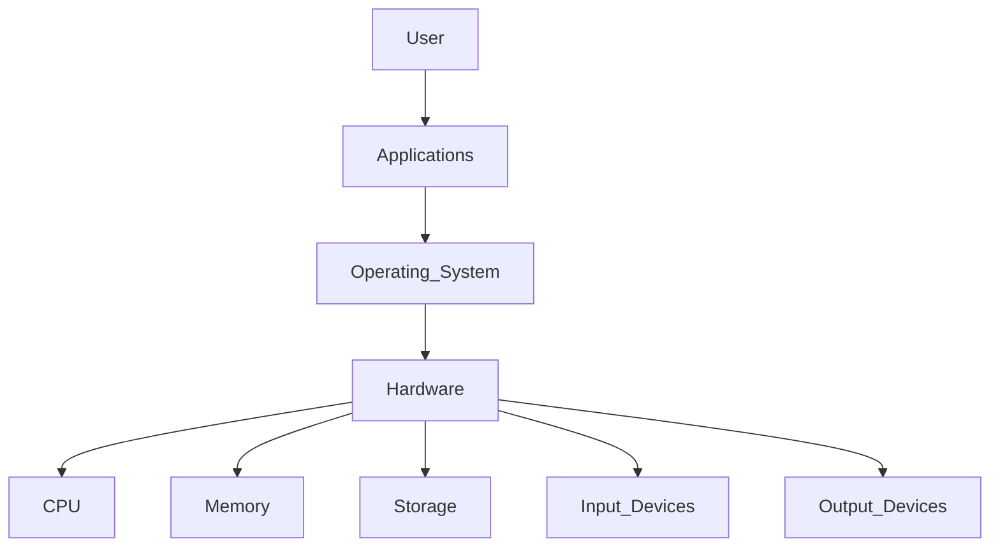
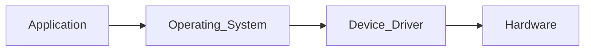

# Lesson 06: Operating Systems Basics

> **Book:** Book 01 – Foundations  
> **Module:** Module 01 – Computer Fundamentals  
> **Lesson:** 06  
> **Difficulty:** Beginner  
> **Estimated Reading Time:** 60–75 Minutes

---

# Learning Objectives

After completing this lesson, you will be able to:

- Define an operating system and explain its importance.
- Understand why computers require an operating system.
- Describe the history and evolution of operating systems.
- Explain how operating systems have evolved alongside computer hardware.
- Identify the major milestones in operating system development.
- Build a strong foundation for understanding advanced operating system concepts in later books.

---

# Prerequisites

Before studying this lesson, you should be familiar with:

- What a computer is
- Computer hardware fundamentals
- Computer software fundamentals
- CPU, memory, storage devices, and input/output devices

These topics were covered in the previous lessons.

---

# Introduction

Imagine entering a large company where hundreds of employees share meeting rooms, printers, computers, internet connections, and office equipment.

Without a manager coordinating these shared resources, confusion would quickly arise. Employees would compete for the same meeting rooms, multiple people might try to use the same printer simultaneously, and important tasks could be delayed.

A computer faces a similar challenge.

Modern computers contain many hardware components:

- Processor (CPU)
- Memory (RAM)
- Storage devices
- Keyboard
- Mouse
- Monitor
- Network adapters
- USB devices
- Printers
- Graphics cards

At the same time, users expect to:

- Browse the internet
- Listen to music
- Watch videos
- Write documents
- Download files
- Attend video meetings
- Run programming tools

All of these activities often occur simultaneously.

Without a central management system, hardware resources would conflict with one another, applications would compete for CPU time, and users would have no simple way to interact with the computer.

The software responsible for coordinating all of these activities is called the **Operating System (OS)**.

The operating system acts as the **manager of the entire computer system**, ensuring that hardware resources are allocated efficiently and applications run smoothly.

---

# What Is an Operating System?

An **Operating System (OS)** is the most important type of system software.

It manages computer hardware, provides services to application programs, and offers an interface through which users can interact with the computer.

### Definition

> **An Operating System is system software that manages computer hardware resources, controls program execution, and provides common services for applications and users.**

Every task performed on a computer passes through the operating system in some way.

Whether you:

- Open a web browser
- Save a document
- Connect to Wi-Fi
- Print a file
- Copy data to a USB drive

the operating system coordinates the necessary hardware and software interactions.

---

# Why Do We Need an Operating System?

To understand the importance of an operating system, imagine a computer without one.

Without an operating system:

- The processor would not know which program to execute next.
- Memory would not be allocated efficiently.
- Hardware devices would not be coordinated.
- Applications would need to communicate directly with every hardware component.
- Users would have no convenient graphical interface to operate the computer.

In practice, modern general-purpose computers rely on an operating system to manage these responsibilities.

The operating system simplifies computing by acting as an intermediary between users, applications, and hardware.



This layered architecture allows applications to use hardware resources through the operating system rather than interacting directly with every device.

---

# Goals of an Operating System

A modern operating system is designed to achieve several important goals.

## 1. Convenience

The operating system makes computers easier to use by providing user interfaces, file management, and application support.

Without it, users would need to issue low-level hardware instructions manually.

---

## 2. Efficiency

Hardware resources are limited.

The operating system allocates CPU time, memory, storage, and peripheral devices efficiently so that multiple programs can share them effectively.

---

## 3. Reliability

The operating system helps ensure that applications run in a stable environment.

If one application encounters an error, modern operating systems often isolate it so that other running applications can continue functioning.

---

## 4. Security

Operating systems provide mechanisms such as:

- User authentication
- Permissions
- File protection
- Encryption support
- Process isolation

These features help protect data and system resources from unauthorized access.

---

## 5. Resource Management

The operating system coordinates the use of:

- CPU
- RAM
- Storage devices
- Printers
- Network interfaces
- USB devices
- Graphics hardware

This coordination enables many applications to run concurrently without interfering with one another.

---

# Evolution of Operating Systems

Operating systems have evolved significantly over the history of computing.

Early computers were extremely different from today's systems.

As hardware became more capable, operating systems also became more sophisticated.

The evolution of operating systems reflects the broader evolution of computer technology.

---

# First Generation (1940s–1950s)

The earliest electronic computers did not have operating systems.

Programs were entered manually using switches, punched cards, or paper tape.

Characteristics:

- One program at a time
- Manual hardware control
- No graphical interface
- No file system
- No multitasking

Programming these systems required extensive knowledge of the hardware.

---

# Second Generation (1950s–1960s)

As computers became more powerful, **batch processing systems** emerged.

Instead of interacting with the computer directly, users submitted jobs that were processed sequentially.

Advantages:

- Reduced idle time
- Improved resource utilization
- Better organization of workloads

Limitations:

- No interactive computing
- Long waiting times for results

---

# Third Generation (1960s–1970s)

This period introduced major improvements in operating system design.

Important innovations included:

- Multiprogramming
- Time-sharing
- Interactive terminals
- Improved scheduling
- Better memory management

Users could now interact with computers more efficiently, and multiple programs could remain in memory simultaneously.

---

# Fourth Generation (1980s–Present)

The introduction of personal computers transformed operating systems.

Operating systems became more user-friendly through graphical user interfaces (GUIs), making computers accessible to a wider audience.

Important developments included:

- Personal computer operating systems
- Graphical desktops
- Networking support
- Plug-and-play hardware
- Multimedia capabilities
- Internet integration

Examples:

- Microsoft Windows
- macOS
- Linux

---

# Modern Operating Systems

Today's operating systems extend far beyond desktop computers.

They power:

- Smartphones
- Tablets
- Smart TVs
- Wearable devices
- Cloud servers
- Embedded systems
- Internet of Things (IoT) devices
- Supercomputers

Modern operating systems emphasize:

- Security
- Performance
- Scalability
- Energy efficiency
- Virtualization support
- Cloud integration

---

# Popular Operating Systems

Some widely used operating systems include:

| Operating System | Common Use Cases |
|------------------|------------------|
| Microsoft Windows | Personal computers, business workstations |
| macOS | Apple desktop and laptop computers |
| Linux | Servers, cloud computing, embedded systems, development |
| Android | Smartphones, tablets, smart TVs |
| iOS | Apple iPhone devices |
| ChromeOS | Chromebooks and cloud-focused laptops |

Each operating system is designed with different goals, hardware platforms, and user requirements in mind.

---

# Did You Know?

The operating system on a modern smartphone manages thousands of background activities—including networking, notifications, power management, application scheduling, and security—while still providing a responsive user experience.


---

# Core Functions of an Operating System

An operating system is much more than a program that starts when a computer is powered on. It is responsible for coordinating every major activity that takes place inside the computer.

Whenever you open an application, save a file, connect a USB drive, or print a document, the operating system works behind the scenes to ensure everything happens correctly and efficiently.

The major functions of an operating system include:

```text
Operating System
│
├── Process Management
├── Memory Management
├── File System Management
├── Device Management
├── Storage Management
├── Security & User Management
├── Networking
└── User Interface
```

Each function plays a vital role in ensuring that a computer system remains stable, secure, and responsive.

---

# Process Management

## What Is a Process?

A **process** is a program that is currently being executed by the computer.

For example:

- Opening Google Chrome creates one or more processes.
- Playing music starts another process.
- Running Visual Studio Code creates additional processes.
- Background services such as antivirus software also run as processes.

Although a computer may have hundreds of programs installed, only the programs currently running are considered processes.

---

## Responsibilities of Process Management

The operating system manages processes by:

- Creating new processes
- Scheduling CPU time
- Suspending and resuming processes
- Synchronizing multiple processes
- Terminating completed processes
- Preventing conflicts between processes

Without process management, two applications could attempt to use the processor simultaneously, resulting in unstable system behavior.

---

## Process Scheduling

Modern computers can run many applications at the same time because the operating system rapidly switches the CPU between processes.

This creates the illusion that multiple applications are running simultaneously.

Example:

```text
Time

Browser
████

Music Player
    ████

VS Code
        ████

Video Call
            ████
```

The CPU executes one process for a short period, then quickly switches to another.

This technique is known as **CPU scheduling** and forms the foundation of multitasking.

---

# Memory Management

## What Is Memory Management?

Memory management is the process of controlling how the computer's main memory (RAM) is allocated and used.

Every running program requires memory to store:

- Instructions
- Variables
- Temporary data
- Program state

The operating system decides:

- Which application receives memory
- How much memory it receives
- When memory is released
- How memory is protected from other programs

---

## Why Memory Management Is Important

Imagine a computer with only 8 GB of RAM.

If several applications are opened simultaneously, they compete for memory.

Without proper management:

- Programs could overwrite each other's data.
- The system could crash.
- Important information might be lost.

The operating system prevents these problems through controlled allocation and protection.

---

## Virtual Memory (Introduction)

Sometimes a computer runs more programs than can fit entirely in RAM.

Modern operating systems use **virtual memory**, temporarily moving less-used data between RAM and storage to free memory for active tasks.

This allows systems to continue operating even when physical memory is limited, although performance may decrease if storage is significantly slower than RAM.

---

# File System Management

## What Is a File System?

A file system is the method an operating system uses to organize, store, and retrieve data on storage devices.

Without a file system, a storage device would simply contain a large collection of bytes with no meaningful organization.

---

## Responsibilities of File Management

The operating system enables users to:

- Create files
- Rename files
- Copy files
- Move files
- Delete files
- Organize folders
- Search for files
- Control file permissions

Applications rely on these services whenever they save or open documents.

---

## Example

When you save a report as:

```text
Documents/
    Report.docx
```

the operating system:

1. Creates the file.
2. Records its location.
3. Updates the directory structure.
4. Stores metadata such as creation date, size, and permissions.

---

# Device Management

Modern computers contain many hardware devices.

Examples include:

- Keyboard
- Mouse
- Printer
- Monitor
- Scanner
- Speakers
- Graphics card
- Webcam
- USB devices

The operating system coordinates communication with these devices.

---

## Device Drivers

Most hardware devices require **device drivers**.

A driver acts as a translator between the operating system and the hardware.

Communication flow:



Without an appropriate driver, hardware may not function correctly or may have limited capabilities.

---

# Storage Management

The operating system also manages long-term storage devices.

Examples include:

- Hard Disk Drives (HDD)
- Solid-State Drives (SSD)
- USB Flash Drives
- Memory Cards
- External Storage

Responsibilities include:

- Allocating storage space
- Managing free space
- Detecting storage errors
- Maintaining file integrity
- Supporting multiple storage devices

Efficient storage management improves both performance and reliability.

---

# Security Management

Protecting data is one of the operating system's most important responsibilities.

Security features commonly include:

- User authentication
- Password management
- File permissions
- Encryption support
- Firewall integration
- Secure boot
- Malware protection support

Modern operating systems also isolate running applications to reduce the impact of software failures or malicious code.

---

# User Management

Many operating systems support multiple user accounts.

Each account can have different permissions and personalized settings.

Common account types include:

- Administrator
- Standard User
- Guest (where supported)

This separation helps protect system settings and user data.

---

# Networking

Operating systems provide built-in networking capabilities.

Typical networking tasks include:

- Connecting to Wi-Fi
- Managing Ethernet connections
- Configuring IP addresses
- Sharing files and printers
- Accessing internet resources
- Communicating with remote systems

Without networking support, modern internet-based applications would not function effectively.

---

# User Interface

The operating system provides the interface through which users interact with the computer.

Two common interfaces are:

## Command-Line Interface (CLI)

Users type commands using a keyboard.

Examples:

- Bash
- PowerShell
- Windows Command Prompt

Advantages:

- Powerful automation
- Efficient for advanced users
- Useful for scripting

---

## Graphical User Interface (GUI)

Users interact using:

- Windows
- Icons
- Menus
- Buttons
- Pointer devices

Advantages:

- Beginner-friendly
- Easy navigation
- Visual interaction

Examples:

- Windows Desktop
- macOS Finder
- GNOME
- KDE Plasma

---

# How These Functions Work Together

Imagine you double-click a document.

The operating system performs many tasks almost instantly:

1. Detects your mouse input.
2. Locates the file on storage.
3. Allocates memory.
4. Starts the required application.
5. Schedules CPU time.
6. Displays the document on the screen.
7. Saves any changes back to storage.

Although this appears to happen instantly, it involves coordination across multiple operating system components.

---

# Did You Know?

Modern desktop operating systems can manage thousands of active processes and many gigabytes of memory simultaneously while keeping applications responsive. Efficient scheduling, memory protection, and resource management make this possible.


---

# Types of Operating Systems

Operating systems are designed for different computing environments and requirements. A smartphone, a banking server, an industrial robot, and a supercomputer all have different needs, so they use different types of operating systems.

Over the years, several categories of operating systems have evolved to address these diverse requirements.

The most common types include:

- Batch Operating System
- Time-Sharing Operating System
- Multiprogramming Operating System
- Multitasking Operating System
- Multi-user Operating System
- Multiprocessing Operating System
- Real-Time Operating System (RTOS)
- Distributed Operating System
- Network Operating System
- Mobile Operating System
- Embedded Operating System

---

# Batch Operating System

## Introduction

A **Batch Operating System** is one of the earliest types of operating systems.

In batch systems, users do not interact directly with the computer. Instead, similar jobs are grouped into batches and executed one after another.

For example, a company may submit hundreds of payroll calculations together. The operating system processes the entire batch without requiring user interaction during execution.

---

## Characteristics

- Jobs are grouped into batches.
- No direct interaction between users and the computer while jobs are running.
- Suitable for repetitive tasks.
- High throughput for large volumes of similar work.

---

## Advantages

- Efficient for repetitive processing.
- Reduces manual intervention.
- Good utilization of system resources.

---

## Limitations

- Long waiting times for results.
- Difficult to debug individual jobs.
- Not suitable for interactive applications.

---

## Common Uses

- Payroll processing
- Utility billing
- Bank statement generation
- Large-scale report generation

---

# Time-Sharing Operating System

## Introduction

A **Time-Sharing Operating System** allows multiple users to interact with the same computer simultaneously.

The CPU rapidly switches between users, giving each one a small amount of processing time known as a **time slice**.

This creates the impression that every user has dedicated access to the computer.

---

## Characteristics

- Interactive computing
- Fast response times
- CPU time divided among users
- Supports multiple terminals

---

## Advantages

- Efficient resource sharing
- Improved user experience
- Supports many simultaneous users

---

## Limitations

- More complex scheduling
- Higher memory requirements
- Performance may decrease under heavy load

---

## Examples

- UNIX
- Linux
- Modern server operating systems

---

# Multiprogramming Operating System

## Introduction

A **Multiprogramming Operating System** keeps multiple programs in memory at the same time.

When one program waits for input or output, the CPU switches to another program instead of remaining idle.

---

## Characteristics

- Several programs loaded simultaneously
- Better CPU utilization
- Increased overall system efficiency

---

## Advantages

- Reduced CPU idle time
- Higher throughput
- Improved resource utilization

---

## Limitations

- More complex memory management
- Requires effective scheduling algorithms

---

# Multitasking Operating System

## Introduction

A **Multitasking Operating System** enables a single user to run multiple applications seemingly at the same time.

For example, a user may:

- Listen to music
- Browse the internet
- Edit a document
- Download files

all while participating in a video meeting.

The operating system rapidly switches CPU attention between running tasks.

---

## Characteristics

- Multiple applications running concurrently
- Fast task switching
- Responsive user experience

---

## Examples

- Windows
- macOS
- Linux
- Android
- iOS

---

# Multi-user Operating System

## Introduction

A **Multi-user Operating System** allows multiple users to use the same computer system while maintaining separate accounts and permissions.

Each user has an independent environment with personal files, settings, and access controls.

---

## Characteristics

- Multiple user accounts
- Access control
- Shared hardware resources
- Centralized administration

---

## Common Applications

- University computer labs
- Enterprise servers
- Cloud computing platforms

---

# Multiprocessing Operating System

## Introduction

A **Multiprocessing Operating System** supports systems with two or more CPUs or processor cores.

Workloads can be distributed across multiple processors, improving overall performance and reliability.

---

## Characteristics

- Multiple CPUs or cores
- Parallel execution
- Increased processing power
- Better fault tolerance in some configurations

---

## Advantages

- Faster execution
- Improved multitasking
- Better resource utilization

---

## Examples

Modern versions of:

- Windows
- Linux
- macOS

all support multiprocessing on multi-core processors.

---

# Real-Time Operating System (RTOS)

## Introduction

A **Real-Time Operating System (RTOS)** is designed for applications where tasks must be completed within strict timing constraints.

Correctness depends not only on producing the right result but also on producing it within the required time.

---

## Characteristics

- Predictable response times
- High reliability
- Minimal latency
- Deterministic scheduling

---

## Applications

- Aircraft control systems
- Medical devices
- Industrial automation
- Automotive control systems
- Robotics

---

## Advantages

- Highly reliable
- Fast response
- Suitable for safety-critical systems

---

## Limitations

- Specialized design
- Less flexible for general-purpose computing

---

# Distributed Operating System

## Introduction

A **Distributed Operating System** manages multiple networked computers and presents them as a unified system.

Users may not need to know which physical machine is performing a task.

---

## Characteristics

- Resource sharing
- Workload distribution
- Fault tolerance
- Scalability

---

## Applications

- Scientific computing
- Cloud infrastructure
- High-performance computing clusters

---

# Network Operating System

## Introduction

A **Network Operating System (NOS)** is designed to manage and provide services across computer networks.

It enables communication, resource sharing, centralized management, and secure access among connected devices.

---

## Common Services

- File sharing
- Printer sharing
- User authentication
- Network security
- Remote access

---

## Examples

- Windows Server
- Linux Server distributions

---

# Mobile Operating System

## Introduction

A **Mobile Operating System** is designed specifically for smartphones, tablets, and other portable devices.

These systems are optimized for touch interfaces, battery efficiency, wireless communication, and mobile hardware.

---

## Characteristics

- Touch-based interface
- Power management
- Mobile application ecosystem
- Wireless connectivity
- Sensor integration

---

## Examples

- Android
- iOS

---

# Embedded Operating System

## Introduction

An **Embedded Operating System** runs on devices built for dedicated functions rather than general-purpose computing.

These systems often operate with limited memory, processing power, and storage.

---

## Applications

- Smart TVs
- Washing machines
- Routers
- Automotive systems
- Medical equipment
- Smart home devices
- Industrial controllers

---

# Comparison of Operating System Types

| Type | Primary Purpose | Typical Example |
|------|-----------------|-----------------|
| Batch | Process grouped jobs | Payroll systems |
| Time-Sharing | Interactive multi-user computing | UNIX, Linux |
| Multiprogramming | Improve CPU utilization | Mainframe systems |
| Multitasking | Run multiple applications | Windows, macOS |
| Multi-user | Support multiple users | Linux servers |
| Multiprocessing | Use multiple CPUs/cores | Modern desktop OSs |
| Real-Time | Meet strict timing requirements | Industrial automation |
| Distributed | Coordinate multiple computers | Computing clusters |
| Network | Provide network services | Windows Server |
| Mobile | Smartphones and tablets | Android, iOS |
| Embedded | Dedicated-purpose devices | Smart appliances |

---

# Choosing the Right Operating System

The choice of operating system depends on the intended use.

| Requirement | Suitable Operating System |
|------------|---------------------------|
| Office work | Windows, macOS, Linux |
| Software development | Linux, macOS, Windows |
| Web servers | Linux, Windows Server |
| Mobile devices | Android, iOS |
| Industrial automation | RTOS |
| Smart appliances | Embedded OS |
| Scientific computing | Distributed OS |
| Enterprise networking | Network OS |

---

# Did You Know?

Although modern desktop operating systems support multitasking, multiprocessing, networking, and multi-user capabilities simultaneously, they are still classified primarily as **general-purpose operating systems** because they are designed to handle a wide variety of everyday computing tasks rather than a single specialized purpose.


---

# Types of Operating Systems

Operating systems are designed for different computing environments and requirements. A smartphone, a banking server, an industrial robot, and a supercomputer all have different needs, so they use different types of operating systems.

Over the years, several categories of operating systems have evolved to address these diverse requirements.

The most common types include:

- Batch Operating System
- Time-Sharing Operating System
- Multiprogramming Operating System
- Multitasking Operating System
- Multi-user Operating System
- Multiprocessing Operating System
- Real-Time Operating System (RTOS)
- Distributed Operating System
- Network Operating System
- Mobile Operating System
- Embedded Operating System

---

# Batch Operating System

## Introduction

A **Batch Operating System** is one of the earliest types of operating systems.

In batch systems, users do not interact directly with the computer. Instead, similar jobs are grouped into batches and executed one after another.

For example, a company may submit hundreds of payroll calculations together. The operating system processes the entire batch without requiring user interaction during execution.

---

## Characteristics

- Jobs are grouped into batches.
- No direct interaction between users and the computer while jobs are running.
- Suitable for repetitive tasks.
- High throughput for large volumes of similar work.

---

## Advantages

- Efficient for repetitive processing.
- Reduces manual intervention.
- Good utilization of system resources.

---

## Limitations

- Long waiting times for results.
- Difficult to debug individual jobs.
- Not suitable for interactive applications.

---

## Common Uses

- Payroll processing
- Utility billing
- Bank statement generation
- Large-scale report generation

---

# Time-Sharing Operating System

## Introduction

A **Time-Sharing Operating System** allows multiple users to interact with the same computer simultaneously.

The CPU rapidly switches between users, giving each one a small amount of processing time known as a **time slice**.

This creates the impression that every user has dedicated access to the computer.

---

## Characteristics

- Interactive computing
- Fast response times
- CPU time divided among users
- Supports multiple terminals

---

## Advantages

- Efficient resource sharing
- Improved user experience
- Supports many simultaneous users

---

## Limitations

- More complex scheduling
- Higher memory requirements
- Performance may decrease under heavy load

---

## Examples

- UNIX
- Linux
- Modern server operating systems

---

# Multiprogramming Operating System

## Introduction

A **Multiprogramming Operating System** keeps multiple programs in memory at the same time.

When one program waits for input or output, the CPU switches to another program instead of remaining idle.

---

## Characteristics

- Several programs loaded simultaneously
- Better CPU utilization
- Increased overall system efficiency

---

## Advantages

- Reduced CPU idle time
- Higher throughput
- Improved resource utilization

---

## Limitations

- More complex memory management
- Requires effective scheduling algorithms

---

# Multitasking Operating System

## Introduction

A **Multitasking Operating System** enables a single user to run multiple applications seemingly at the same time.

For example, a user may:

- Listen to music
- Browse the internet
- Edit a document
- Download files

all while participating in a video meeting.

The operating system rapidly switches CPU attention between running tasks.

---

## Characteristics

- Multiple applications running concurrently
- Fast task switching
- Responsive user experience

---

## Examples

- Windows
- macOS
- Linux
- Android
- iOS

---

# Multi-user Operating System

## Introduction

A **Multi-user Operating System** allows multiple users to use the same computer system while maintaining separate accounts and permissions.

Each user has an independent environment with personal files, settings, and access controls.

---

## Characteristics

- Multiple user accounts
- Access control
- Shared hardware resources
- Centralized administration

---

## Common Applications

- University computer labs
- Enterprise servers
- Cloud computing platforms

---

# Multiprocessing Operating System

## Introduction

A **Multiprocessing Operating System** supports systems with two or more CPUs or processor cores.

Workloads can be distributed across multiple processors, improving overall performance and reliability.

---

## Characteristics

- Multiple CPUs or cores
- Parallel execution
- Increased processing power
- Better fault tolerance in some configurations

---

## Advantages

- Faster execution
- Improved multitasking
- Better resource utilization

---

## Examples

Modern versions of:

- Windows
- Linux
- macOS

all support multiprocessing on multi-core processors.

---

# Real-Time Operating System (RTOS)

## Introduction

A **Real-Time Operating System (RTOS)** is designed for applications where tasks must be completed within strict timing constraints.

Correctness depends not only on producing the right result but also on producing it within the required time.

---

## Characteristics

- Predictable response times
- High reliability
- Minimal latency
- Deterministic scheduling

---

## Applications

- Aircraft control systems
- Medical devices
- Industrial automation
- Automotive control systems
- Robotics

---

## Advantages

- Highly reliable
- Fast response
- Suitable for safety-critical systems

---

## Limitations

- Specialized design
- Less flexible for general-purpose computing

---

# Distributed Operating System

## Introduction

A **Distributed Operating System** manages multiple networked computers and presents them as a unified system.

Users may not need to know which physical machine is performing a task.

---

## Characteristics

- Resource sharing
- Workload distribution
- Fault tolerance
- Scalability

---

## Applications

- Scientific computing
- Cloud infrastructure
- High-performance computing clusters

---

# Network Operating System

## Introduction

A **Network Operating System (NOS)** is designed to manage and provide services across computer networks.

It enables communication, resource sharing, centralized management, and secure access among connected devices.

---

## Common Services

- File sharing
- Printer sharing
- User authentication
- Network security
- Remote access

---

## Examples

- Windows Server
- Linux Server distributions

---

# Mobile Operating System

## Introduction

A **Mobile Operating System** is designed specifically for smartphones, tablets, and other portable devices.

These systems are optimized for touch interfaces, battery efficiency, wireless communication, and mobile hardware.

---

## Characteristics

- Touch-based interface
- Power management
- Mobile application ecosystem
- Wireless connectivity
- Sensor integration

---

## Examples

- Android
- iOS

---

# Embedded Operating System

## Introduction

An **Embedded Operating System** runs on devices built for dedicated functions rather than general-purpose computing.

These systems often operate with limited memory, processing power, and storage.

---

## Applications

- Smart TVs
- Washing machines
- Routers
- Automotive systems
- Medical equipment
- Smart home devices
- Industrial controllers

---

# Comparison of Operating System Types

| Type | Primary Purpose | Typical Example |
|------|-----------------|-----------------|
| Batch | Process grouped jobs | Payroll systems |
| Time-Sharing | Interactive multi-user computing | UNIX, Linux |
| Multiprogramming | Improve CPU utilization | Mainframe systems |
| Multitasking | Run multiple applications | Windows, macOS |
| Multi-user | Support multiple users | Linux servers |
| Multiprocessing | Use multiple CPUs/cores | Modern desktop OSs |
| Real-Time | Meet strict timing requirements | Industrial automation |
| Distributed | Coordinate multiple computers | Computing clusters |
| Network | Provide network services | Windows Server |
| Mobile | Smartphones and tablets | Android, iOS |
| Embedded | Dedicated-purpose devices | Smart appliances |

---

# Choosing the Right Operating System

The choice of operating system depends on the intended use.

| Requirement | Suitable Operating System |
|------------|---------------------------|
| Office work | Windows, macOS, Linux |
| Software development | Linux, macOS, Windows |
| Web servers | Linux, Windows Server |
| Mobile devices | Android, iOS |
| Industrial automation | RTOS |
| Smart appliances | Embedded OS |
| Scientific computing | Distributed OS |
| Enterprise networking | Network OS |

---

# Did You Know?

Although modern desktop operating systems support multitasking, multiprocessing, networking, and multi-user capabilities simultaneously, they are still classified primarily as **general-purpose operating systems** because they are designed to handle a wide variety of everyday computing tasks rather than a single specialized purpose.


---

# Boot Process

## Introduction

When you press the power button on a computer, the operating system is not loaded immediately. A sequence of hardware and software operations takes place before you see the desktop or login screen.

This sequence is known as the **boot process**.

The boot process ensures that all hardware components are initialized, essential software is loaded, and the operating system is prepared to accept user input.

---

# Steps in the Boot Process

The following simplified sequence illustrates how a modern computer starts.

```text
Power On
    │
    ▼
Firmware (BIOS / UEFI)
    │
    ▼
POST (Power-On Self-Test)
    │
    ▼
Boot Device Selection
    │
    ▼
Boot Loader
    │
    ▼
Operating System Kernel
    │
    ▼
System Services
    │
    ▼
Login Screen / Desktop
```

Each stage has a specific responsibility.

---

## Step 1 – Power On

When the power button is pressed:

- The power supply provides electricity to the motherboard.
- The CPU resets and begins execution.
- Firmware stored on the motherboard takes control.

---

## Step 2 – Firmware Initialization

The firmware initializes essential hardware components, such as:

- Processor
- RAM
- Keyboard
- Display adapter
- Storage controllers
- USB controllers

Modern computers typically use **UEFI**, while many older systems used **BIOS**.

---

## Step 3 – POST (Power-On Self-Test)

POST verifies that essential hardware is functioning correctly.

Typical checks include:

- CPU detection
- Memory (RAM) testing
- Keyboard detection
- Storage device detection
- Graphics initialization

If a critical problem is detected, the system may display an error message or emit beep codes.

---

## Step 4 – Boot Device Selection

The firmware searches for a bootable device based on the configured boot order.

Common boot devices include:

- Internal SSD
- Internal HDD
- USB flash drive
- Optical disc
- Network boot server

Once a valid boot device is found, control passes to its boot loader.

---

## Step 5 – Boot Loader

The **boot loader** is a small program responsible for loading the operating system kernel into memory.

Examples include:

- Windows Boot Manager
- GRUB (GNU GRand Unified Bootloader)
- systemd-boot

Some boot loaders allow users to choose between multiple installed operating systems.

---

## Step 6 – Kernel Initialization

The **kernel** is the core component of an operating system.

After being loaded, it:

- Initializes hardware drivers.
- Sets up memory management.
- Starts process scheduling.
- Mounts file systems.
- Prepares the system for user-space applications.

---

## Step 7 – System Services

Background services required for normal operation are started.

Examples include:

- Networking
- Printing services
- Time synchronization
- Audio services
- Security services
- User authentication

---

## Step 8 – Login and Desktop

Finally, the user is presented with:

- A login screen, or
- The desktop environment (if automatic login is enabled).

The operating system is now ready for use.

---

# BIOS vs. UEFI

Firmware is responsible for preparing the hardware before the operating system starts.

Historically, computers used the **Basic Input/Output System (BIOS)**. Most modern computers now use the **Unified Extensible Firmware Interface (UEFI)**.

| Feature | BIOS | UEFI |
|--------|------|------|
| Introduced | Earlier PCs | Modern systems |
| Interface | Text-based | Graphical interface available on many systems |
| Disk Support | Smaller partitioning limits | Supports very large storage devices |
| Boot Speed | Generally slower | Generally faster |
| Security | Limited | Supports Secure Boot and other security features |

Although UEFI has largely replaced BIOS in new computers, both perform the same fundamental role of initializing hardware and starting the operating system.

---

# The Kernel

## What Is the Kernel?

The **kernel** is the central component of an operating system.

It acts as a bridge between software applications and computer hardware.

Applications request services from the kernel rather than accessing hardware directly.

---

## Responsibilities of the Kernel

The kernel is responsible for:

- Process scheduling
- Memory management
- Device management
- Interrupt handling
- File system access
- Security enforcement
- Resource allocation

Without the kernel, applications would not be able to safely share hardware resources.

---

# User Space and Kernel Space

Modern operating systems separate execution into two primary areas:

```text
+---------------------------+
|       User Space          |
| Applications              |
| Web Browser               |
| Media Player              |
| Text Editor               |
+---------------------------+
            │
            ▼
+---------------------------+
|      Kernel Space         |
| Process Manager           |
| Memory Manager            |
| Device Drivers            |
| File System               |
+---------------------------+
            │
            ▼
+---------------------------+
|        Hardware           |
+---------------------------+
```

This separation helps improve system stability and security.

---

# Shell

The **shell** is the component through which users interact with the operating system.

It accepts user commands and requests services from the kernel.

There are two common types of shells.

---

## Command-Line Shell (CLI)

A command-line interface allows users to interact by typing commands.

Examples:

- Bash
- Zsh
- PowerShell
- Windows Command Prompt

Advantages:

- Powerful automation
- Fast for experienced users
- Scriptable

---

## Graphical Shell (GUI)

A graphical shell provides:

- Windows
- Icons
- Menus
- Buttons
- Pointer interaction

Examples include:

- Windows Desktop
- macOS Desktop
- GNOME
- KDE Plasma

Graphical interfaces make computers easier for beginners to use.

---

# File Systems

A **file system** defines how files and folders are organized and stored on a storage device.

It keeps track of:

- File names
- Folder hierarchy
- Storage locations
- Permissions
- Metadata

Examples of common file systems include:

- NTFS (Windows)
- APFS (macOS)
- ext4 (Linux)
- FAT32
- exFAT

Different file systems are optimized for different operating systems and storage requirements.

---

# Virtual Memory

Physical RAM is limited.

To allow larger workloads, operating systems implement **virtual memory**.

Virtual memory temporarily moves less frequently used data between RAM and storage, allowing active applications to continue running even when physical memory is nearly full.

Benefits include:

- Improved multitasking
- Better memory utilization
- Ability to run larger applications

However, relying heavily on virtual memory can reduce performance because storage devices are generally slower than RAM.

---

# Virtualization (Introduction)

Virtualization allows multiple virtual computers to run on a single physical machine.

Each virtual computer behaves like an independent system with its own operating system and applications.

A software layer called a **hypervisor** manages these virtual machines.

Benefits include:

- Efficient hardware utilization
- Isolation between workloads
- Easier testing and development
- Simplified server consolidation

Virtualization is widely used in cloud computing and enterprise data centers.

---

# Containers (Introduction)

Containers provide a lightweight method for packaging applications together with their required libraries and dependencies.

Unlike traditional virtual machines, containers share the host operating system kernel while keeping applications isolated from one another.

Advantages include:

- Fast startup
- Efficient resource usage
- Consistent deployment across environments
- Simplified application distribution

Containers have become a standard approach for deploying modern cloud-native applications.

---

# Virtual Machines vs. Containers

| Feature | Virtual Machine | Container |
|---------|-----------------|-----------|
| Operating System | Separate guest OS | Shares host kernel |
| Startup Time | Generally slower | Generally faster |
| Resource Usage | Higher | Lower |
| Isolation | Strong | Process-level isolation |
| Typical Use | Multiple operating systems | Application deployment |

---

# Putting It All Together

When you start a computer:

1. Firmware initializes the hardware.
2. POST verifies essential components.
3. The boot loader loads the kernel.
4. The kernel initializes system resources.
5. System services start.
6. The user logs in through the shell or graphical desktop.
7. Applications run in user space while the kernel manages hardware access.

This layered design helps make modern operating systems secure, reliable, and efficient.

---

# Did You Know?

Many cloud providers run thousands of virtual machines and containers on shared physical servers. Virtualization and container technologies enable efficient resource sharing while keeping workloads isolated from one another.


---

# Best Practices for Using an Operating System

Using an operating system effectively involves more than simply knowing how to open applications. Following good practices helps improve performance, reliability, and security.

## Keep the Operating System Updated

Software updates often include:

- Security patches
- Bug fixes
- Performance improvements
- New features
- Hardware compatibility updates

Installing updates regularly helps keep the system secure and stable.

---

## Install Software from Trusted Sources

Download applications only from:

- Official vendor websites
- Trusted app stores
- Reputable package repositories

Avoid installing software from unknown or unverified sources, as it may contain malware or unwanted programs.

---

## Use Strong Security Measures

Protect your system by:

- Creating strong passwords
- Enabling multi-factor authentication where available
- Locking your computer when unattended
- Using antivirus or endpoint protection where appropriate
- Keeping the firewall enabled

---

## Organize Files and Folders

A well-organized file system makes information easier to locate and reduces the risk of accidental deletion.

Recommended practices:

- Use meaningful file names.
- Create logical folder structures.
- Back up important files regularly.
- Remove unnecessary files periodically.

---

## Shut Down Properly

Avoid turning off the computer by disconnecting power unless absolutely necessary.

A proper shutdown:

- Closes running applications.
- Saves pending changes.
- Prevents file system corruption.
- Protects hardware components.

---

# Common Mistakes Beginners Make

Many operating system problems are caused by avoidable mistakes.

Common examples include:

- Ignoring software updates.
- Downloading programs from untrusted websites.
- Using weak or reused passwords.
- Deleting important system files.
- Installing too many unnecessary applications.
- Disabling security features without understanding their purpose.
- Storing all files in a single folder.
- Failing to maintain backups.

Developing good habits early helps create a more secure and reliable computing environment.

---

# Real-World Case Study

## A Student's Laptop

A university student purchases a new laptop for coursework.

After powering it on for the first time, the following sequence occurs:

1. UEFI firmware initializes the hardware.
2. POST verifies that essential components are functioning.
3. The boot loader loads the operating system kernel.
4. The operating system starts networking, audio, display, and other background services.
5. The login screen appears.
6. The student signs in.
7. The desktop environment loads.
8. The student opens a web browser, a PDF reader, and a word processor.

While the student writes an assignment, the operating system:

- Allocates CPU time to each application.
- Manages memory usage.
- Saves files to storage.
- Maintains Wi-Fi connectivity.
- Checks for updates in the background.
- Protects the system using built-in security mechanisms.

Although these operations appear seamless, they involve continuous coordination between the kernel, device drivers, file system, scheduler, and hardware.

---

# Chapter Summary

In this lesson, you learned:

- The definition and purpose of an operating system.
- The historical evolution of operating systems.
- The core responsibilities of an operating system.
- Different categories of operating systems and their applications.
- The computer boot process.
- The roles of firmware, boot loaders, kernels, and shells.
- The importance of file systems and virtual memory.
- Introductory concepts in virtualization and containers.
- Best practices for operating system maintenance and security.

Together, these concepts explain how modern computers coordinate hardware and software to deliver a stable, secure, and user-friendly computing experience.

---

# Glossary

| Term | Definition |
|------|------------|
| Operating System (OS) | System software that manages hardware resources and provides services to applications. |
| Process | A program that is currently being executed. |
| Scheduler | Component responsible for deciding which process receives CPU time. |
| Kernel | The core part of the operating system that manages hardware resources. |
| Shell | User interface that allows interaction with the operating system. |
| BIOS | Basic Input/Output System, legacy firmware used to initialize hardware. |
| UEFI | Unified Extensible Firmware Interface, the modern replacement for BIOS. |
| Boot Loader | Program that loads the operating system kernel into memory. |
| File System | Method used to organize and manage files on storage devices. |
| Virtual Memory | Technique that extends available memory by using storage as temporary memory. |
| Hypervisor | Software that creates and manages virtual machines. |
| Container | A lightweight, isolated environment for running applications while sharing the host operating system kernel. |

---

# Practice Exercises

## Exercise 1 – Identify the Operating System

Write down the operating system used on:

- Your laptop or desktop computer
- Your smartphone
- A smart television
- An ATM
- A Wi-Fi router

Discuss why each device may use a different type of operating system.

---

## Exercise 2 – Observe the Boot Process

Restart your computer and note:

- The firmware screen (if visible)
- The operating system logo
- The login screen
- The approximate startup time

Identify the stages discussed in this lesson.

---

## Exercise 3 – Explore System Information

Using your operating system's system information tool, record:

- Operating system name
- Version
- Processor
- Installed RAM
- Storage capacity
- File system type

---

## Exercise 4 – Compare Interfaces

Create a table comparing:

- Command-Line Interface (CLI)
- Graphical User Interface (GUI)

Include:

- Ease of use
- Typical users
- Advantages
- Limitations
- Examples

---

## Exercise 5 – Research Activity

Choose one operating system (Windows, Linux, macOS, Android, or iOS) and answer:

- Who develops it?
- Where is it commonly used?
- What are its strengths?
- What are its limitations?

---

# Interview Questions

## Beginner Level

1. What is an operating system?
2. Why is an operating system necessary?
3. What is a process?
4. What is the purpose of memory management?
5. What is a file system?
6. What is a device driver?
7. What is the difference between BIOS and UEFI?
8. What is the kernel?
9. What is the shell?
10. What is virtual memory?

---

## Intermediate Level

1. Explain the boot process step by step.
2. Differentiate between multitasking and multiprocessing.
3. Compare Batch and Time-Sharing operating systems.
4. Explain how process scheduling enables multitasking.
5. Compare virtual machines and containers.
6. Describe the responsibilities of the kernel.
7. Explain why operating systems use virtual memory.
8. Discuss the importance of file systems.
9. What are the benefits of virtualization?
10. Why is user and permission management important?

---

# Mini Quiz

Choose the correct answer.

### 1. Which component loads the operating system kernel?

A. Compiler

B. Boot Loader

C. Shell

D. File System

**Answer:** **B**

---

### 2. Which part of the operating system manages hardware resources?

A. Browser

B. Application

C. Kernel

D. Editor

**Answer:** **C**

---

### 3. Which firmware standard has largely replaced BIOS in modern computers?

A. DOS

B. FAT32

C. UEFI

D. NTFS

**Answer:** **C**

---

### 4. Which operating system type is designed for strict timing requirements?

A. Batch OS

B. Mobile OS

C. Real-Time OS

D. Network OS

**Answer:** **C**

---

### 5. Which interface primarily uses typed commands?

A. GUI

B. CLI

C. Desktop

D. Touch Interface

**Answer:** **B**

---

# Key Takeaways

- The operating system is the foundation of every modern computer system.
- It manages processes, memory, files, devices, storage, networking, and security.
- Different operating systems are designed for different environments, including desktops, servers, mobile devices, embedded systems, and industrial applications.
- The boot process prepares hardware and loads the operating system before users can interact with the computer.
- The kernel is the central component that coordinates hardware resources.
- Modern operating systems support virtualization and container technologies to improve flexibility and resource utilization.
- Good operating system practices help maintain performance, security, and reliability.

---

# Further Reading

To continue your learning journey, explore these topics:

- Computer Networks
- Computer Architecture
- Linux Fundamentals
- Windows Administration
- System Programming
- Virtualization Technologies
- Cloud Computing
- Cybersecurity Fundamentals

These topics build directly on the concepts introduced in this lesson and will appear in later DevAtlas books.

---

# References

The concepts in this lesson are based on widely accepted principles of operating systems, computer architecture, and systems programming. They align with introductory computer science curricula and common industry practices. As DevAtlas evolves, examples and terminology should be reviewed periodically against current operating system documentation and educational resources to remain accurate and relevant.

---

# End of Lesson

🎉 **Congratulations!**

You have successfully completed **Lesson 06 – Operating Systems Basics**.

You can now:

- Explain the role of an operating system.
- Describe its major functions.
- Identify different operating system types.
- Understand the boot process.
- Explain the purpose of kernels, shells, and file systems.
- Recognize the importance of virtualization and containers at a foundational level.
