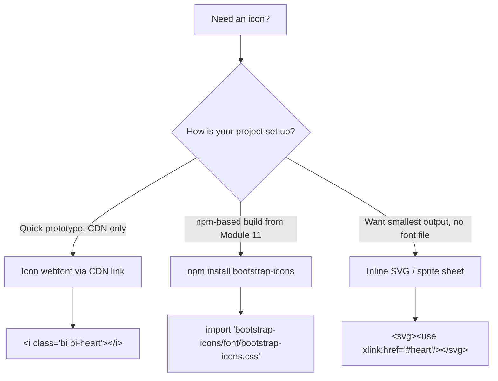
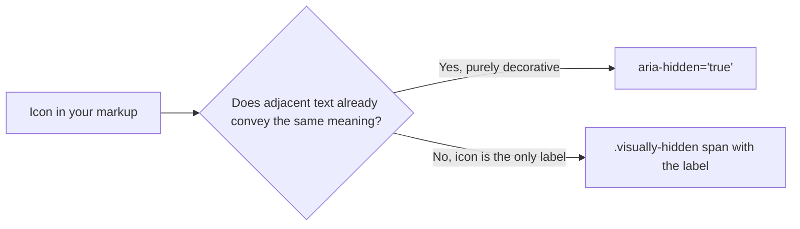

# Lesson 01: Bootstrap Icons

## Learning Objectives
- Install and reference Bootstrap Icons via CDN, npm, or SVG sprite
- Apply icons inline, sized, and colored consistently with the theme system
- Use the `fill="currentColor"` pattern from Module 09 for icon color inheritance
- Combine icons correctly with `.visually-hidden` and `aria-hidden` for accessibility

## Introduction
Throughout this book, icon references have appeared as placeholders — `<svg class="bi">` in Module 09's icon-link lesson, generic icon buttons in Module 06 and Module 08. This lesson finally covers where those icons actually come from: Bootstrap Icons, an official, separate icon library maintained by the Bootstrap team, designed to integrate cleanly with everything covered across this entire book.

## Three Ways to Include Bootstrap Icons



**CDN (webfont), matching this book's default workflow:**
```html
<link rel="stylesheet" href="https://cdn.jsdelivr.net/npm/bootstrap-icons/font/bootstrap-icons.min.css">
<i class="bi bi-heart"></i>
<i class="bi bi-cart"></i>
```

**npm, for a Module 11 Sass build:**
```bash
npm install bootstrap-icons
```
```scss
// scss/custom.scss
@import "../node_modules/bootstrap-icons/font/bootstrap-icons.scss";
```

**Inline SVG / sprite**, the format previewed in Module 09, Lesson 07:
```html
<svg class="bi" width="16" height="16" fill="currentColor">
  <use xlink:href="bootstrap-icons.svg#heart"/>
</svg>
```

## Sizing and Coloring Icons
Webfont icons (the `<i class="bi bi-*">` approach) behave like text characters, so ordinary font-size and text-color utilities apply directly:

```html
<i class="bi bi-star fs-3 text-warning"></i>
<i class="bi bi-check-circle fs-5 text-success"></i>
```

SVG icons instead use `width`/`height` attributes for sizing, and rely on `fill="currentColor"` for color — the exact detail flagged without full explanation back in Module 09, Lesson 07:

```html
<svg class="bi text-danger" width="24" height="24" fill="currentColor">
  <use xlink:href="bootstrap-icons.svg#trash"/>
</svg>
```

`fill="currentColor"` means the icon inherits whatever CSS `color` value applies to it — here, `.text-danger` — so the icon and any adjacent text stay color-synchronized automatically, without a separate icon-specific color rule.

## Accessibility: Decorative vs. Meaningful Icons
This distinction matters, and directly reuses the accessibility patterns consolidated in Module 09, Lesson 09:



```html
<!-- Decorative: "Delete" text already says everything -->
<button class="btn btn-danger">
  <i class="bi bi-trash" aria-hidden="true"></i> Delete
</button>

<!-- Meaningful: icon-only button, no visible text -->
<button class="btn btn-outline-secondary">
  <i class="bi bi-trash" aria-hidden="true"></i>
  <span class="visually-hidden">Delete item</span>
</button>
```

Note `aria-hidden="true"` is used on the icon itself in BOTH cases — the icon glyph is always decorative from an accessibility standpoint; what changes is whether adjacent visible text already provides the accessible label, or whether a `.visually-hidden` span needs to supply it instead. This is the exact same pattern first established for the button-embedded spinner in Module 08, Lesson 09.

## Practical Example
A toolbar combining icon-only and icon-plus-text buttons, correctly labeled:

```html
<div class="btn-toolbar" role="toolbar" aria-label="Document actions">
  <div class="btn-group me-2">
    <button class="btn btn-outline-secondary" title="Save">
      <i class="bi bi-save" aria-hidden="true"></i>
      <span class="visually-hidden">Save</span>
    </button>
    <button class="btn btn-outline-secondary" title="Print">
      <i class="bi bi-printer" aria-hidden="true"></i>
      <span class="visually-hidden">Print</span>
    </button>
  </div>
  <button class="btn btn-danger">
    <i class="bi bi-trash" aria-hidden="true"></i> Delete
  </button>
</div>
```

## Revision Questions

<details>
<summary>1. What are the three ways to include Bootstrap Icons in a project, and which matches this book's default CDN-based workflow?</summary>
CDN webfont link, npm install (for a Module 11 Sass build), or inline SVG/sprite; the CDN webfont link matches this book's default workflow of using CDN-hosted Bootstrap resources throughout.
</details>

<details>
<summary>2. Why do webfont icons respond to `.text-{color}` and `.fs-*` utilities directly, while SVG icons need `fill="currentColor"` instead?</summary>
Webfont icons render as font glyphs (like text characters), so they inherit standard font-size/color CSS properties directly; SVG icons are graphics, not text, so they need `fill="currentColor"` to explicitly inherit the surrounding CSS `color` value.
</details>

<details>
<summary>3. Why is `aria-hidden="true"` applied to an icon glyph even when a `.visually-hidden` label is also present for it?</summary>
The icon graphic itself is always decorative from an accessibility standpoint; the `.visually-hidden` span is what actually supplies the meaningful label to screen readers, so the icon itself should never be separately announced on top of that label.
</details>

<details>
<summary>4. What's the deciding factor for whether an icon needs `aria-hidden="true"` alone, versus needing a `.visually-hidden` span alongside it?</summary>
Whether adjacent visible text already conveys the same meaning (icon can be purely `aria-hidden`) or the icon is the only label present, with no visible text (a `.visually-hidden` span must supply the accessible label).
</details>
