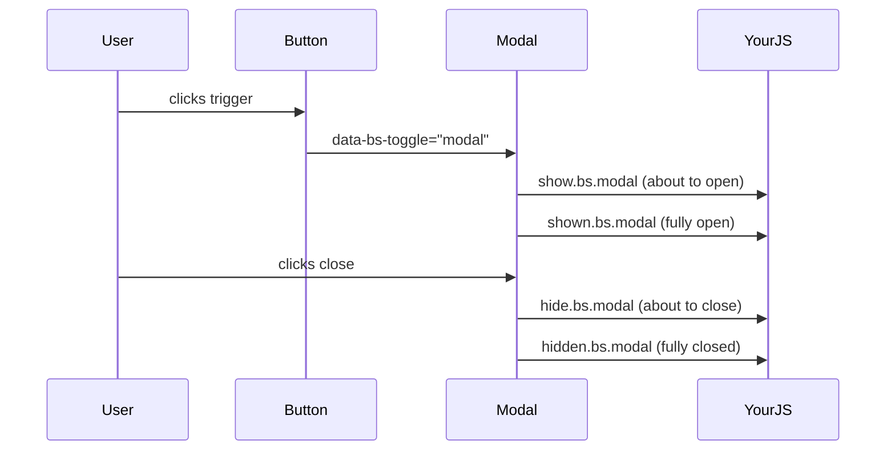
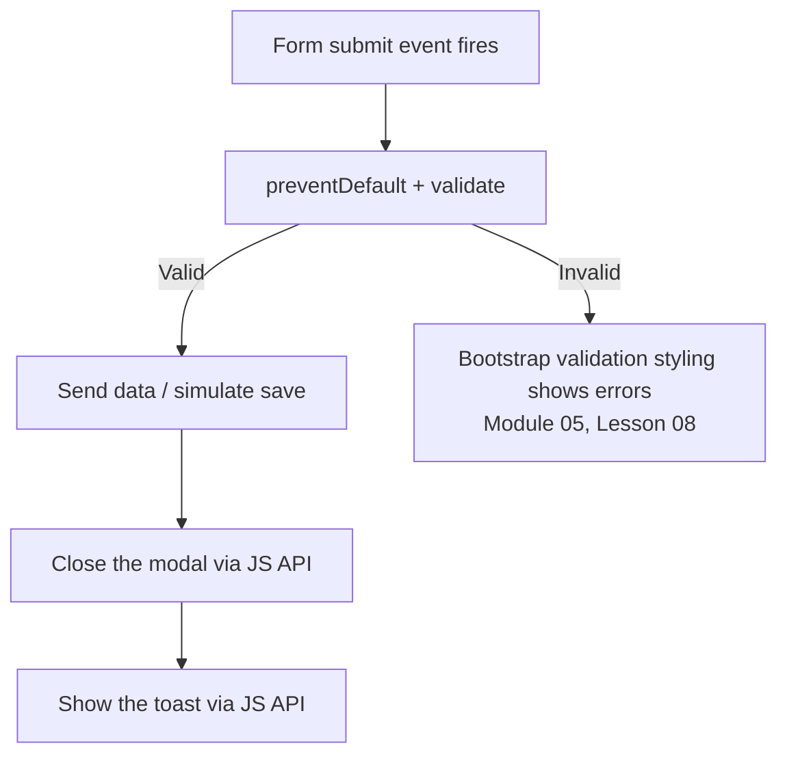

# Lesson 02: Integrating Bootstrap JS with Vanilla JS

## Learning Objectives
- Combine Bootstrap's data-attribute components with custom vanilla JS logic
- Listen to Bootstrap's own component events (`shown.bs.modal`, `hidden.bs.collapse`, etc.)
- Use the Bootstrap JavaScript API directly, rather than only data attributes
- Coordinate multiple Bootstrap components driven by one piece of application state

## Introduction
Every JS-driven component since Module 08 has used the data-attribute pattern almost exclusively — genuinely sufficient for the vast majority of real use cases. This lesson covers the remaining piece needed for the capstone project in Lesson 03: what happens when your OWN application logic needs to react to a Bootstrap component's state changing, or needs to control a component programmatically rather than purely through a user's click.

## Bootstrap's Custom Events
Every component with JS behavior (modal, collapse, dropdown, offcanvas, tab, toast, carousel — everything since Module 08) fires its own custom events at each stage of its show/hide lifecycle:



```javascript
const myModal = document.getElementById('exampleModal');

myModal.addEventListener('shown.bs.modal', () => {
  // Runs once the modal is fully visible — a good place to focus a specific input
  document.getElementById('modalFirstInput').focus();
});

myModal.addEventListener('hidden.bs.modal', () => {
  // Runs once the modal is fully closed — a good place to reset a form
  document.getElementById('modalForm').reset();
});
```

This is the exact same `addEventListener` pattern used since Book 04 and reused throughout this entire book (range inputs, form validation, spinners) — the only new piece is the event NAME itself, which follows Bootstrap's `{stage}.bs.{component}` naming convention consistently across every component.

## Controlling Components via the JavaScript API
Beyond listening to events, you can also trigger component behavior directly through Bootstrap's JS objects, rather than only via a user click on a `data-bs-toggle` element — genuinely necessary when a component needs to open or close as a RESULT of application logic (a successful form submission, a fetched API response) rather than a direct click:

```javascript
const myModalEl = document.getElementById('exampleModal');
const myModal = new bootstrap.Modal(myModalEl);

// Later, triggered by some application event rather than a click:
myModal.show();
myModal.hide();
myModal.toggle();
```

`bootstrap.getInstance(element)` retrieves an already-initialized component's JS object without creating a duplicate one — useful when you need to control a component from a DIFFERENT part of your code than where it was originally initialized:

```javascript
const existingModal = bootstrap.Modal.getInstance(document.getElementById('exampleModal'));
existingModal.hide();
```

## Coordinating Multiple Components from One State Change
A realistic integration scenario: a form submission should close a modal AND show a confirmation toast, two independent Module 08 components coordinated by one piece of custom application logic:



```javascript
document.getElementById('settingsForm').addEventListener('submit', function(event) {
  event.preventDefault();

  if (!this.checkValidity()) {
    this.classList.add('was-validated');
    return;
  }

  // Simulate a successful save
  const modal = bootstrap.Modal.getInstance(document.getElementById('settingsModal'));
  modal.hide();

  const toastEl = document.getElementById('saveToast');
  const toast = new bootstrap.Toast(toastEl);
  toast.show();
});
```

Notice this single handler reuses THREE separate concepts spanning this entire book: Module 05's `checkValidity()`/`.was-validated` validation pattern, Module 08's Modal JS API, and Module 08's Toast JS API — genuine integration, not a new component.

## Practical Example
A confirm-and-notify flow: clicking "Delete" opens a confirmation modal; confirming inside the modal closes it and shows a toast, using events and the JS API together:

```html
<button class="btn btn-danger" data-bs-toggle="modal" data-bs-target="#confirmModal">Delete item</button>

<div class="modal fade" id="confirmModal" tabindex="-1">
  <div class="modal-dialog modal-dialog-centered">
    <div class="modal-content">
      <div class="modal-body">Are you sure you want to delete this item?</div>
      <div class="modal-footer">
        <button class="btn btn-secondary" data-bs-dismiss="modal">Cancel</button>
        <button class="btn btn-danger" id="confirmDeleteBtn">Delete</button>
      </div>
    </div>
  </div>
</div>

<div class="toast-container position-fixed bottom-0 end-0 p-3">
  <div id="deleteToast" class="toast" role="alert" aria-live="assertive" aria-atomic="true">
    <div class="toast-body">Item deleted.</div>
  </div>
</div>

<script>
  document.getElementById('confirmDeleteBtn').addEventListener('click', () => {
    const modal = bootstrap.Modal.getInstance(document.getElementById('confirmModal'));
    modal.hide();
    new bootstrap.Toast(document.getElementById('deleteToast')).show();
  });
</script>
```

## Revision Questions

<details>
<summary>1. What naming convention do Bootstrap's custom component events follow?</summary>
`{stage}.bs.{component}`, e.g. `shown.bs.modal`, `hidden.bs.collapse` — consistent across every JS-driven component since Module 08.
</details>

<details>
<summary>2. Why would you need the JavaScript API (`new bootstrap.Modal(...)`) instead of the data-attribute pattern used throughout Module 08?</summary>
When a component needs to open or close as a result of application logic (a form submission completing, an API response arriving) rather than a direct user click on a `data-bs-toggle` element.
</details>

<details>
<summary>3. What does `bootstrap.Modal.getInstance(element)` do, and why is it useful?</summary>
It retrieves an already-initialized component's JS object without creating a duplicate — useful when controlling a component from a different part of your code than where it was originally created.
</details>

<details>
<summary>4. In the form-submission practical example, which three concepts from earlier in this book does the single event handler combine?</summary>
Module 05's `checkValidity()`/`.was-validated` validation pattern, Module 08's Modal JavaScript API, and Module 08's Toast JavaScript API.
</details>
