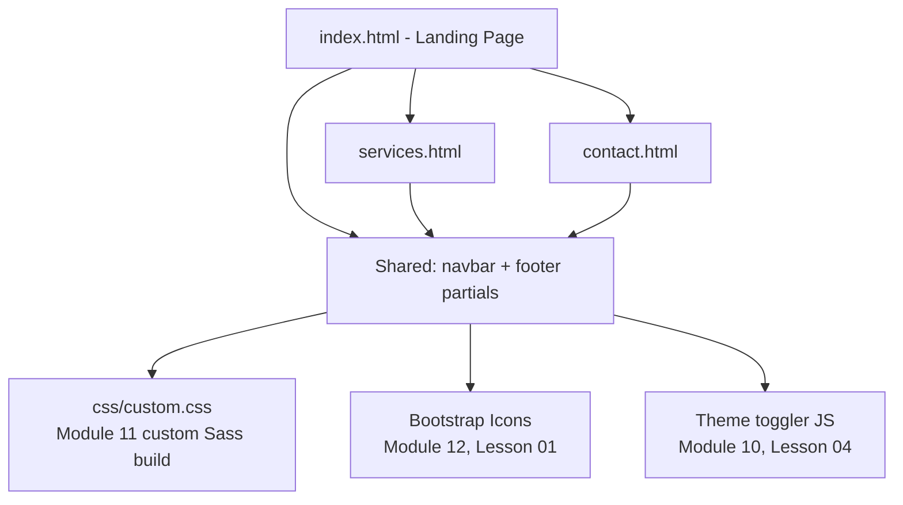
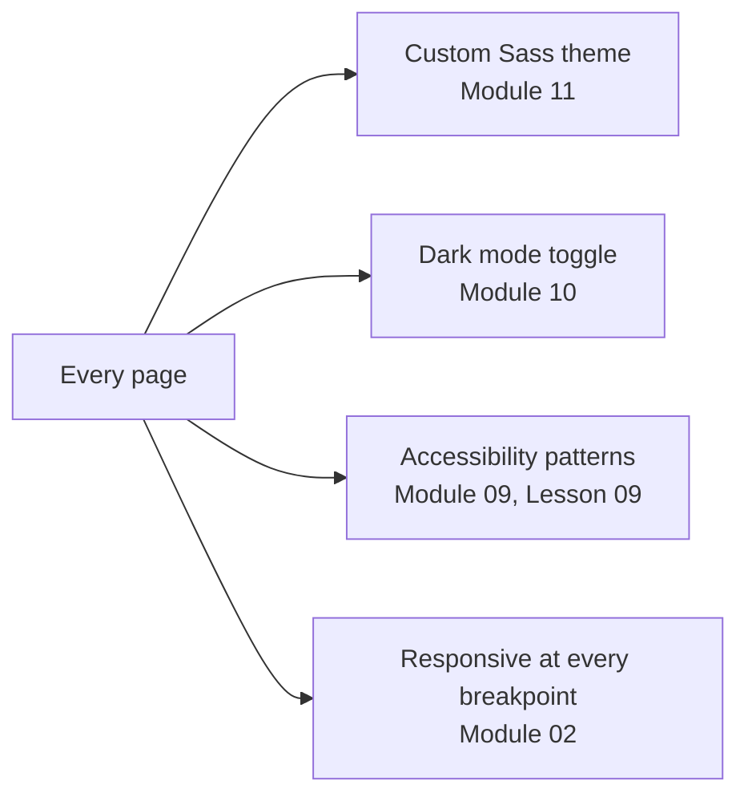
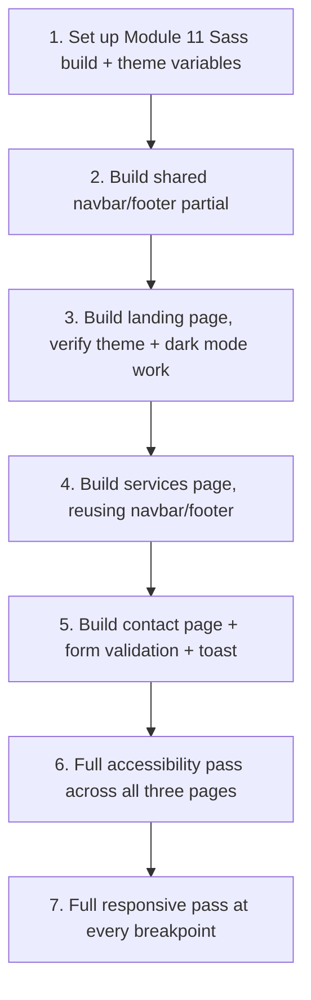

# Lesson 03: Capstone Project

## Learning Objectives
- Plan a real-world multi-page site using every module's techniques from this book
- Structure a project's file/component organization at a realistic scale
- Identify which module's component or utility solves each piece of a real design requirement
- Apply the Module 11 custom Sass build and Module 12 icon/JS integration to a complete, working project

## Introduction
This final lesson doesn't introduce new Bootstrap mechanics — it's a capstone specification, walking through building a complete small business website end to end, calling out explicitly which module and lesson each design decision draws from. Treat this as the bridge between "I know what each Bootstrap piece does in isolation" and "I can assemble them into a real product," which is the actual skill this entire book has been building toward.

## The Project: A Small Business Marketing Site
The brief: a landing page, a services page, and a contact page for a fictional local business, with a working custom theme, dark mode, and full accessibility.



## Page-by-Page Module Mapping

### Landing Page (`index.html`)
| Section | Component | Module |
|---|---|---|
| Navbar with theme toggle | `.navbar` + `.navbar-toggler` | Module 07, Lesson 01 |
| Hero section | `.min-vh-100`, flex centering | Module 09, Lesson 01–02 |
| Feature cards (3-column) | `.row-cols-md-3` + `.card.h-100` | Module 06, Lesson 05 |
| Testimonial carousel | `.carousel` | Module 08, Lesson 04 |
| Newsletter signup | `.form-control` + `.input-group` | Module 05, Lessons 01, 05 |
| Footer | `.hstack` + `.vr` dividers | Module 09, Lesson 04, 06 |

### Services Page (`services.html`)
| Section | Component | Module |
|---|---|---|
| Breadcrumb | `.breadcrumb` | Module 07, Lesson 03 |
| Service accordion (FAQ-style detail) | `.accordion` | Module 08, Lesson 02 |
| Pricing tiers | `.card` + `.list-group-flush` | Module 06, Lesson 05; Module 07, Lesson 07 |
| "Book now" modal | `.modal` + validated form | Module 08, Lesson 01; Module 05, Lesson 08 |

### Contact Page (`contact.html`)
| Section | Component | Module |
|---|---|---|
| Contact form | Full grid layout + validation | Module 05, Lessons 07–08 |
| Success toast on submit | `.toast` + JS API | Module 08, Lesson 07; Module 12, Lesson 02 |
| Map/location card | `.ratio` embed | Module 09, Lesson 03 |
| Social icon links | Bootstrap Icons + `.icon-link` | Module 12, Lesson 01; Module 09, Lesson 07 |

## Cross-Cutting Requirements (Apply to All Three Pages)



- **Custom theme**: one shared `css/custom.css`, compiled once via Module 11's Sass workflow, linked identically on all three pages
- **Dark mode**: the Module 10, Lesson 04 toggler script included once, in a shared script file, so theme choice persists across page navigation via `localStorage`
- **Accessibility**: every icon-only button gets a `.visually-hidden` label or `aria-hidden` (Module 12, Lesson 01); every custom `tabindex="0"` element gets a `.focus-ring` (Module 09, Lesson 08); all seven patterns from Module 09, Lesson 09 should be checked against each new component added
- **Responsiveness**: every layout built with the grid (Module 02) and tested at each breakpoint from mobile through `xxl`, not just verified at one desktop width

## A Suggested Build Order
Rather than building all three pages simultaneously, build in this order to catch integration issues early:



Building the shared navbar/footer and theme FIRST, then verifying dark mode actually works correctly, catches integration problems (a CSS variable that isn't wired up quite right, a script that isn't loading before it's needed) while the project is still small — far cheaper to fix than after three full pages already depend on a broken foundation.

## Practical Example
A minimal but complete skeleton demonstrating the shared-partial structure in practice (illustrative — a real project would split the navbar/footer into actual separate include files via a templating approach or build tool, which is outside Bootstrap's own scope):

```html
<!DOCTYPE html>
<html lang="en" data-bs-theme="light">
<head>
  <meta charset="UTF-8">
  <meta name="viewport" content="width=device-width, initial-scale=1.0">
  <link rel="stylesheet" href="css/custom.css">
  <link rel="stylesheet" href="https://cdn.jsdelivr.net/npm/bootstrap-icons/font/bootstrap-icons.min.css">
  <title>Home | Local Business</title>
  <script>
    (function() {
      const saved = localStorage.getItem('theme');
      const systemDark = window.matchMedia('(prefers-color-scheme: dark)').matches;
      document.documentElement.setAttribute('data-bs-theme', saved || (systemDark ? 'dark' : 'light'));
    })();
  </script>
</head>
<body>
  <nav class="navbar navbar-expand-lg navbar-dark bg-primary">
    <div class="container">
      <a class="navbar-brand" href="index.html">Local Business</a>
      <button class="btn btn-outline-light btn-sm ms-auto" id="themeToggle">
        <i class="bi bi-moon-stars" aria-hidden="true"></i>
        <span class="visually-hidden">Toggle theme</span>
      </button>
    </div>
  </nav>

  <main class="d-flex align-items-center justify-content-center text-center min-vh-100 px-3">
    <div>
      <h1>Welcome to Local Business</h1>
      <p class="lead">Quality service, right in your neighborhood.</p>
      <a href="services.html" class="btn btn-primary btn-lg">View Our Services</a>
    </div>
  </main>

  <footer class="hstack gap-2 justify-content-center p-3 text-body-secondary">
    <span>&copy; 2026 Local Business</span>
    <div class="vr"></div>
    <a href="contact.html" class="link-secondary">Contact</a>
  </footer>

  <script src="https://cdn.jsdelivr.net/npm/bootstrap@5.3.3/dist/js/bootstrap.bundle.min.js"></script>
  <script src="js/theme-toggle.js"></script>
</body>
</html>
```

## Revision Questions

<details>
<summary>1. Why does the suggested build order put the shared navbar/footer and theme setup before building any individual page's unique content?</summary>
It surfaces integration problems (a misconfigured CSS variable, a script loading in the wrong order) while the project is still small and easy to debug, rather than discovering them after three full pages already depend on a broken shared foundation.
</details>

<details>
<summary>2. Which module's components are responsible for the services page's pricing tiers, and which for its "Book now" flow?</summary>
Pricing tiers use `.card` + `.list-group-flush` (Modules 06 and 07); the "Book now" flow uses a `.modal` (Module 08) containing a validated form (Module 05).
</details>

<details>
<summary>3. Why is dark mode's toggler script included once, in a shared file, rather than duplicated per page?</summary>
So the user's saved theme preference (via `localStorage`) persists consistently across page navigation, and the toggle behavior stays identical everywhere without needing to keep multiple copies of the same script in sync.
</details>

<details>
<summary>4. What four cross-cutting requirements should be checked against every page in the project, regardless of that page's specific content?</summary>
The custom Sass theme, dark mode support, accessibility patterns (Module 09, Lesson 09's seven patterns), and full responsiveness across every breakpoint.
</details>
