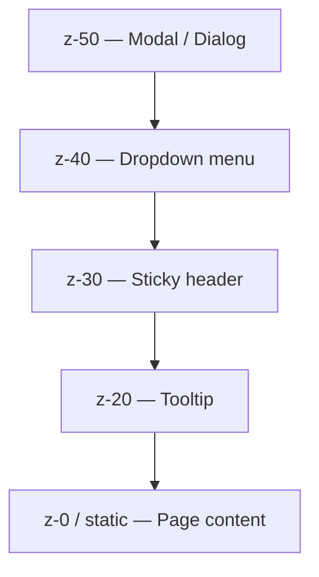

# Lesson 05: Position, Inset, and Z-Index

## Learning Objectives
- Apply Tailwind's positioning utilities (`static`, `relative`, `absolute`, `fixed`, `sticky`)
- Use `inset-*` and directional offset utilities to place positioned elements precisely
- Control stacking order with `z-*` utilities

## Introduction
Book 03 covered CSS positioning in depth — the difference between `static`, `relative`, `absolute`, `fixed`, and `sticky`, and how absolutely positioned elements are placed relative to their nearest positioned ancestor. Tailwind exposes each positioning value, plus a compact system for setting offsets and stacking order.

## Position Utilities

| Class | CSS |
|---|---|
| `static` | `position: static` (default) |
| `relative` | `position: relative` |
| `absolute` | `position: absolute` |
| `fixed` | `position: fixed` |
| `sticky` | `position: sticky` |

As in plain CSS, an `absolute` child positions relative to its nearest ancestor that isn't `static` — typically one you've explicitly marked `relative`:

```html
<div class="relative h-40 w-40 bg-gray-200">
  <span class="absolute right-2 top-2 rounded-full bg-red-500 px-2 text-xs text-white">
    New
  </span>
</div>
```

## Inset and Directional Offsets

`inset-*` sets `top`, `right`, `bottom`, and `left` all at once:

```html
<div class="fixed inset-0 bg-black/50"><!-- full-screen overlay --></div>
```

`inset-0` here means the overlay stretches to all four edges of its positioning context. You also have `inset-x-*` (left + right), `inset-y-*` (top + bottom), and individual `top-*`/`right-*`/`bottom-*`/`left-*` for single-side offsets — all using the same spacing scale from Lesson 2.

For layouts that need to support both left-to-right and right-to-left languages, Tailwind also provides logical-property equivalents — `start-*` and `end-*` instead of `left-*`/`right-*` — which automatically flip direction based on the page's text direction. Module 09 covers Tailwind's full RTL support in the context of migrating from Bootstrap, which required a separate build step for the same thing.

## Z-Index

`z-*` controls stacking order exactly like the CSS `z-index` property, using a scale of `z-0`, `z-10`, `z-20`, `z-30`, `z-40`, `z-50`, and `z-auto`. Higher numbers stack above lower ones, but only among elements that are positioned (not `static`) — a `z-50` on a `static` element has no effect, exactly as in plain CSS.



A common real-world pattern: give your sticky header a mid-range z-index (`z-30`), so a modal overlay (`z-50`) always stacks above it, while a dropdown (`z-40`) stacks above the header but below the modal.

## Practical Example

A sticky header, a dropdown that appears above it, and a modal overlay above everything:

```html
<header class="sticky top-0 z-30 bg-white shadow">Header</header>

<div class="relative">
  <button>Menu</button>
  <div class="absolute z-40 mt-2 w-48 rounded bg-white shadow-lg">Dropdown content</div>
</div>

<div class="fixed inset-0 z-50 flex items-center justify-center bg-black/50">
  <div class="rounded bg-white p-6">Modal content</div>
</div>
```

## Summary
Tailwind's position utilities map directly to CSS `position` values. `inset-*` (and its `-x`/`-y` and single-side variants, plus logical `start-*`/`end-*`) set offsets for positioned elements. `z-*` controls stacking order among positioned elements, following the same rule as plain CSS — it has no effect on `static` elements.

## Revision Questions

<details>
<summary>1. What does `inset-0` set, and on what does an absolutely positioned element with `inset-0` size itself relative to?</summary>

It sets `top`, `right`, `bottom`, and `left` all to `0`. The element stretches to fill its nearest positioned ancestor (or the viewport, if none exists and the element is `fixed`).
</details>

<details>
<summary>2. Why won't `z-50` have any visible stacking effect on an element that's still `static`?</summary>

`z-index` only affects the stacking order of positioned elements (`relative`, `absolute`, `fixed`, `sticky`) — exactly as in plain CSS, it's ignored on `static` elements.
</details>

<details>
<summary>3. What's the advantage of `start-*`/`end-*` over `left-*`/`right-*` for a multilingual app?</summary>

They're logical properties that automatically flip direction based on the page's text direction (`dir="rtl"` vs `dir="ltr"`), so the same classes work correctly for both left-to-right and right-to-left languages without needing separate RTL-specific overrides.
</details>
