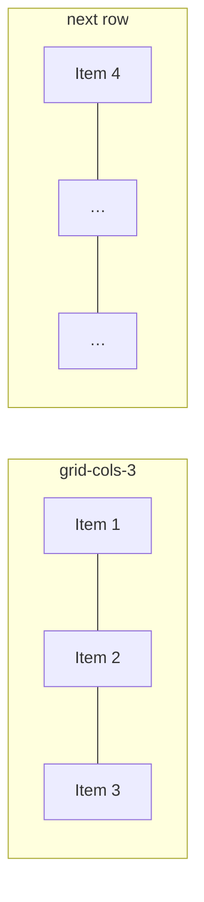

# Lesson 10: Grid Basics and Tracks

## Learning Objectives
- Enable a grid container and define column/row tracks
- Use auto-generated tracks and control grid flow direction
- Recognize when Grid (two-dimensional) is the better fit over Flexbox (one-dimensional)

## Introduction
Book 03 distinguished Flexbox (one-dimensional — a single row or column) from CSS Grid (two-dimensional — rows and columns together, with explicit track sizing). Tailwind's grid utilities map directly onto this model.

## Enabling Grid

```html
<div class="grid grid-cols-3 gap-4">
  <div class="bg-blue-200 p-4">1</div>
  <div class="bg-blue-200 p-4">2</div>
  <div class="bg-blue-200 p-4">3</div>
  <div class="bg-blue-200 p-4">4</div>
</div>
```

`grid` sets `display: grid`. `grid-cols-3` creates three equal-width columns (`repeat(3, minmax(0, 1fr))`); items automatically flow into them, wrapping to a new row once a row fills up. `gap-4` (from Lesson 9) works identically here to add spacing between both rows and columns.



## Column and Row Track Utilities

| Class | CSS |
|---|---|
| `grid-cols-1` … `grid-cols-12` | `grid-template-columns: repeat(N, minmax(0, 1fr))` |
| `grid-rows-1` … `grid-rows-6` | `grid-template-rows: repeat(N, minmax(0, 1fr))` |
| `grid-cols-none` | removes explicit columns |

For a column count outside the built-in scale, or a non-uniform track pattern, use an arbitrary value: `grid-cols-[200px_1fr_200px]` defines three tracks with explicit sizes (a fixed sidebar, flexible middle, fixed sidebar — the Grid equivalent of the Flexbox pattern from Lesson 8, but two-dimensional).

## Auto Columns/Rows and Grid Flow

When items overflow the explicitly defined tracks, `auto-cols-*`/`auto-rows-*` control the size of the implicitly created tracks:

```html
<div class="grid grid-flow-col auto-cols-max gap-4">
  <div class="bg-blue-200 p-4">A</div>
  <div class="bg-blue-200 p-4">B</div>
</div>
```

`grid-flow-col` changes the auto-placement direction from the default (row-by-row) to column-by-column — useful for horizontally scrolling card layouts, for instance.

## When to Reach for Grid Over Flexbox

A practical rule of thumb: if you're arranging items along a single direction (a nav bar, a row of buttons, a vertically stacked form) — Flexbox (Lessons 7–9). If you need explicit control over both rows and columns simultaneously (a photo gallery, a dashboard layout, a calendar) — Grid. Many real UIs use both together: Grid for the page's overall structure, Flexbox for aligning content within individual grid cells.

## Practical Example

A responsive product grid — one column on mobile, three on desktop (responsive variants covered fully in Module 05, previewed here since it's the standard pattern):

```html
<div class="grid grid-cols-1 gap-6 md:grid-cols-3">
  <div class="rounded-lg border p-4">Product 1</div>
  <div class="rounded-lg border p-4">Product 2</div>
  <div class="rounded-lg border p-4">Product 3</div>
</div>
```

## Summary
`grid` enables Grid layout. `grid-cols-*`/`grid-rows-*` define explicit tracks, defaulting to equal-width columns; arbitrary values (`grid-cols-[200px_1fr_200px]`) allow non-uniform tracks. `auto-cols-*`/`auto-rows-*` size implicitly-created tracks, and `grid-flow-*` controls auto-placement direction. Grid suits two-dimensional layouts; Flexbox suits one-dimensional arrangements — many UIs combine both.

## Revision Questions

<details>
<summary>1. What does `grid-cols-3` generate, and what happens once a fourth item is added?</summary>

It sets `grid-template-columns: repeat(3, minmax(0, 1fr))` — three equal-width columns. A fourth item automatically wraps to a new row, still following the three-column track definition.
</details>

<details>
<summary>2. How would you create a three-column layout with a fixed 200px sidebar, a flexible middle, and a fixed 200px right rail?</summary>

`grid-cols-[200px_1fr_200px]` — an arbitrary value defining three explicit, non-uniform tracks.
</details>

<details>
<summary>3. Give one example each of a layout better suited to Flexbox versus one better suited to Grid.</summary>

Flexbox: a horizontal navigation bar or a vertically stacked form (one-dimensional arrangement). Grid: a photo gallery or dashboard needing explicit row-and-column control simultaneously (two-dimensional arrangement).
</details>
